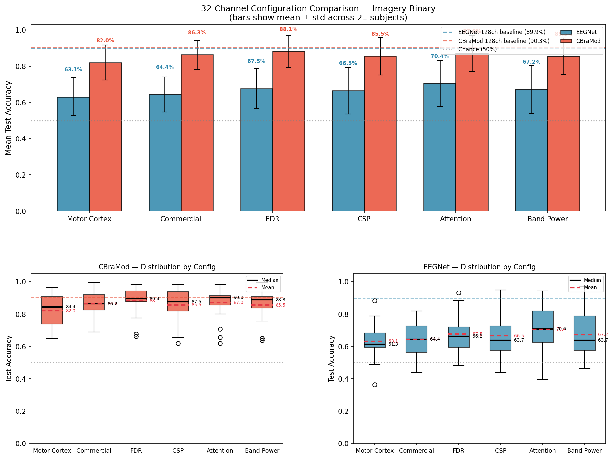
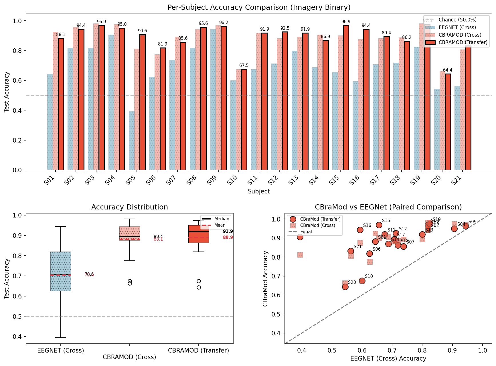
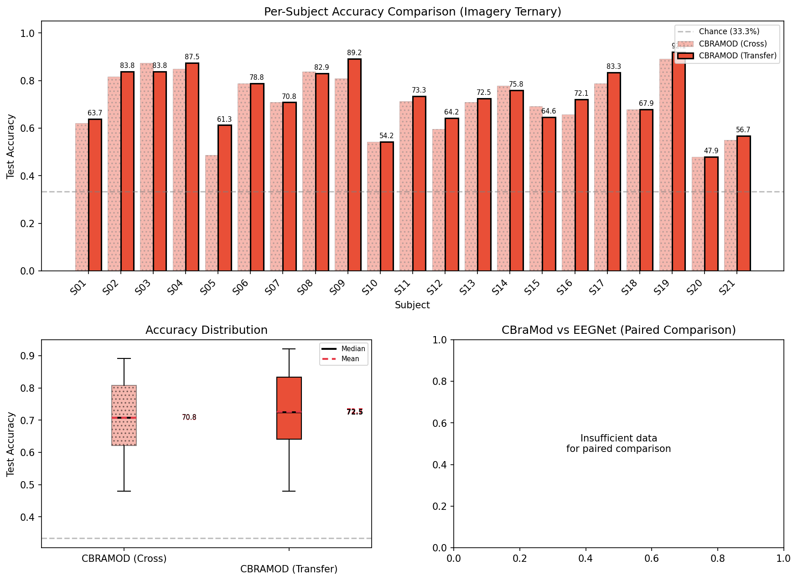
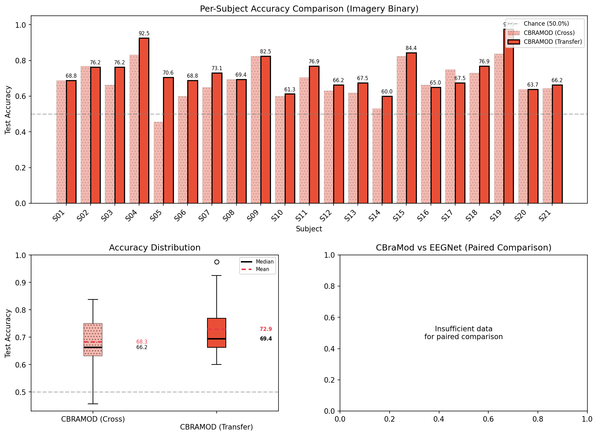
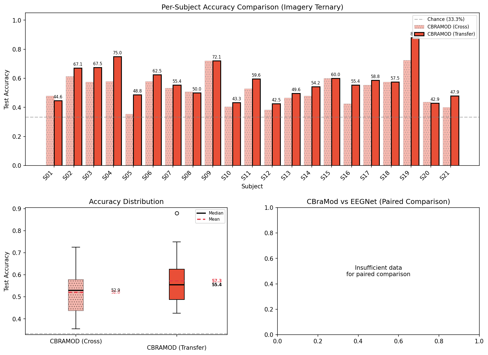

# 减通道实验总结：代码变更 + FDR 方法说明

**Date**: 2026-02-22
**Scope**: 32ch 6 配置对比 + FDR 扩展实验 + 8ch FDR 实验 + 基础设施泛化

---

## 本阶段工作总结

自上次 commit 以来，完成了完整的 **32 通道实验管线**（Steps 1-3）——使用 FDR/CSP/Attention/Band Power 四种方法计算数据驱动通道选择，对 6 种 32ch 配置进行跨被试binary任务下的对比（确认 FDR 为 CBraMod 最优，88.10% vs 128ch 基线 90.27%）。
而后补充了 CBraMod 的 ternary cross-subject 和 binary/ternary transfer 实验。
<!-- 随后将通道选择基础设施**泛化至任意通道数**（`get_nch_indices` 通用函数、`channel_config`/`channel_n_target` 字段、training 脚本 strategy E 逻辑统一），使 `run_reduced_channel_experiment.py` 支持 `--channels`/`--models`/`--steps`，`run_32ch_config_comparison.py` 支持 `--channels`。 -->
最后回到8ch执行了 **8ch FDR 实验**（binary + ternary cross-subject + transfer），发现 32→8ch 存在约 20% 的性能断崖，且 transfer 微调在低通道数下效果更显著（+4.59%/+5.26%）。所有实验结果已记录至 `docs/dev_log/experiments/32ch_experiment.md`。

---

## FDR（Fisher 判别比）方法说明

**FDR（Fisher Discriminant Ratio）** 衡量每个 EEG 通道对分类任务的区分能力：

$$\text{FDR}_{ch} = \frac{(\mu_1 - \mu_2)^2}{\sigma_1^2 + \sigma_2^2}$$

分子是两类信号均值之差（类间距离），分母是两类信号方差之和（类内散度）。直觉上：**类间差异越大、类内波动越小，FDR 越高，该通道越有判别价值**。

对每个时间点计算后取平均，得到每个通道的标量得分，选得分最高的 N 个通道。

优点是纯统计、无需模型、计算极快；缺点是假设类别可线性分离，且对每个通道独立评估，不考虑通道间的空间协同。

---

## 关键结果图

### 32ch 6 配置对比（Step 2）

*32ch Binary Cross-Subject — 6 配置综合对比（FDR 最优：88.10%，128ch 基线：90.27%）*

### 32ch FDR 扩展实验（Step 3）

*32ch FDR CBraMod — Binary Transfer (cross=88.10% → transfer=88.90%)*

*32ch FDR CBraMod — Ternary Transfer (cross=70.79% → transfer=72.68%)*

### 8ch FDR 实验（Step 4）

*8ch FDR CBraMod — Binary Transfer (cross=68.33% → transfer=72.92%, +4.59%)*

*8ch FDR CBraMod — Ternary Transfer (cross=52.00% → transfer=57.26%, +5.26%)*

---

## 核心数据速查

| 配置 | Binary Cross | Binary Transfer | Ternary Cross | Ternary Transfer |
|------|-------------|----------------|--------------|-----------------|
| 128ch (baseline) | 90.27% | — | 75.42% | — |
| 61ch standard¹ | 88.72% | — | — | — |
| 32ch FDR | 88.10% | 88.90% (+0.80%) | 70.79% | 72.68% (+1.89%) |
| 32ch commercial | 86.40% | — | — | — |
| 8ch FDR | 68.33% | 72.92% (+4.59%) | 52.00% | 57.26% (+5.26%) |

---

## FDR vs Commercial vs 61ch 对比 (2026-02-28)

> **61ch 配置来源**: Yazıcı et al. (2025). "Effect of EEG Electrode Numbers on Source Estimation in Motor Imagery." *Brain Sciences*, 15(7), 685. [DOI: 10.3390/brainsci15070685](https://doi.org/10.3390/brainsci15070685) — 对比 19/30/61/118 通道，发现 61ch 准确率最高 (84.73%)，优于 118ch (83.95%)。

### CBraMod Binary Cross-Subject

| 配置 | 通道数 | Mean Acc | vs 128ch | vs 32ch FDR |
|------|--------|----------|----------|-------------|
| 128ch baseline | 128 | 90.27% | — | +2.17pp |
| 61ch standard¹ | 61 | 88.72% | -1.55pp | +0.62pp |
| 32ch FDR | 32 | 88.10% | -2.17pp | — |
| 32ch commercial | 32 | 86.40% | -3.87pp | -1.70pp |

### 关键结论

1. **FDR > Commercial +1.70pp** (14/21 被试 FDR 胜出) — 数据驱动选择显著优于标准布局
2. **61ch ≈ 32ch FDR** (仅差 0.62pp) — FDR 用一半通道接近 61ch 性能，额外通道边际贡献极小
3. **Commercial 更稳定但更低** (std 7.95% vs 8.80%) — 全脑均匀布局跨被试稳定性好，但均值低
4. **通道退化非线性**: 128→61ch -1.55pp, 61→32ch FDR -0.62pp, 128→32ch commercial -3.87pp

**完整实验记录**: `docs/dev_log/experiments/32ch_experiment.md`
