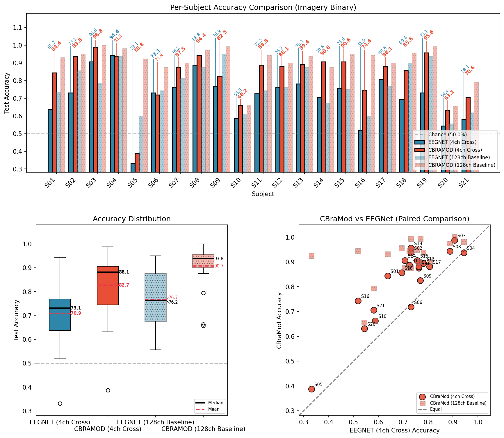
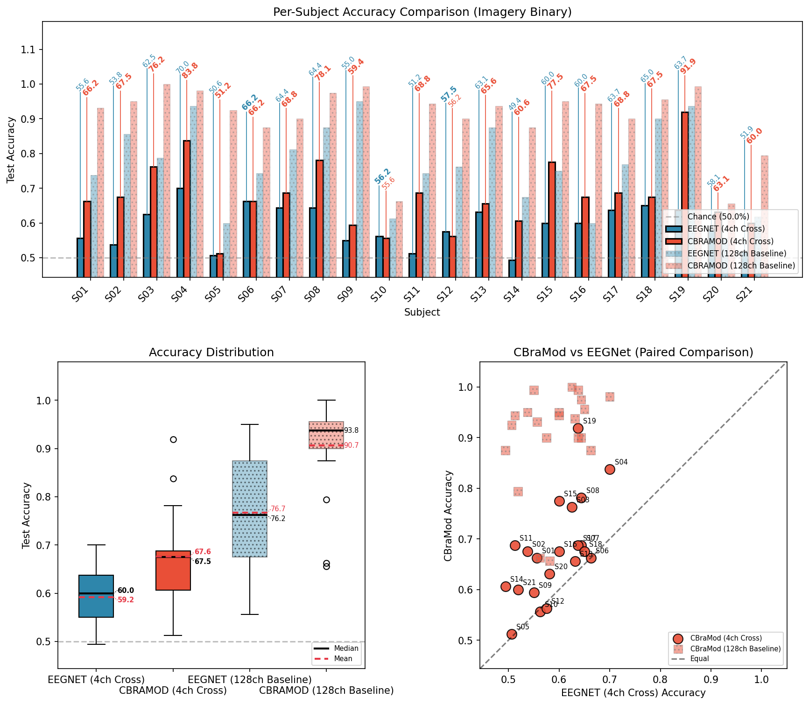

# 基于 EEG 基座模型的手指级运动想象分类：通道缩减、纵向数据扩展与领域自适应预训练的局限性

> **草稿说明**：本文为工作草稿（v3）。文中大部分图表为脚本自动生成的初步输出，**尚未进行出版级精修**（坐标轴标签、字体大小、配色方案、排版布局等）。标有 `[TODO]` 的章节表示数据需最终核实或补充可视化。
>
> **v3 变更摘要**：
> - 论文语言从英文转为中文（技术术语保留英文）
> - 新增多 session 纵向扩展实验结果（原 TODO 6.2，现 Section 3.4）
> - 新增领域自适应 further pre-training 负面结果（Section 2.7 + 3.6）
> - 新增推理性能基准测试（Section 3.8）
> - 新增容量与预训练消融（Section 3.7）：EEGNet 容量阶梯（16K → 30M，§3.7.1）+ random-init CBraMod（§3.7.2）+ 架构 / 预训练 / 容量三向分解（§3.7.3）
> - HPO 方法论纳入 Methods（Section 2.5.1）
> - "Ongoing Experiments" 改为 "Future Work"

---

## 摘要

脑机接口（Brain-Computer Interface, BCI）通过脑电图（EEG）解码单指运动意图，在精细运动康复领域具有重要应用前景，但高密度电极阵列的部署限制了其临床推广。本研究系统对比了大规模 EEG 基座模型 CBraMod（~4M 参数，ICLR 2025）与轻量级卷积神经网络 EEGNet-16,4（~10K 参数）在单指运动想象（Motor Imagery, MI）分类中的性能，覆盖 21 名健康被试、128 通道 BioSemi 系统、被试内/跨被试/XSI-FT（Cross-Subject-Initialized Per-Subject Fine-Tuning）三种训练范式。

在三种训练范式下（128 通道），CBraMod 一致优于 EEGNet——被试内二分类 **+7.05 pp**（85.15% vs 78.10%）、跨被试二分类 **+14.01 pp**（90.68% vs 76.67%）、跨被试三分类 **+13.65 pp**（74.88% vs 61.23%）——其中跨被试范式下双位数 pp 的差距是本研究最稳健的 backbone 改进。两项互补消融把该差距拆分为架构 / 预训练 / 容量三向贡献：(a) **EEGNet 容量阶梯（16K → 1.90M → 5.84M → 30M）** 显示 cross-subject 准确率从 76.67% 单调下降至 51.37% / 50%（chance），证明在 EEGNet 架构内扩参反而显著有害（**−25 pp**），容量本身不是瓶颈；(b) **random-init CBraMod 消融** 显示在 ~30M 参数 + 无预训练同等条件下，CBraMod 仍领先扩参 EEGNet **+34.97 pp**（cross-subject），证实 transformer + ACPE 架构归纳偏置是 cross 范式下最大贡献；TUEG 预训练再追加 ~+4 pp（cross / XSI-FT）至 ~**+27 pp**（被试内：random-init 落到 62.05%，反而低于 EEGNet baseline 78.10%）。三向分解把基座模型价值精准定位为"架构在 cross 主导、预训练在 within 主导"，而非通用增益。

在通道缩减方面，我们评估了 128、64、61、32、8、4 通道配置及四种数据驱动选择方法（Fisher 判别比、共空间模式、梯度注意力、频带功率）和一种商用布局。Fisher 判别比（FDR）选取的 32 通道配置保留了 128 通道 CBraMod 性能的 96.7%（87.71% vs 90.68%），64 通道 FDR 进一步达到 98.7%（89.46%），而 EEGNet 在 32 通道相同条件下降至 74.70%。通道选择方法之间的差异随通道数递减而扩大（32 通道 ~3 pp 差异，8 通道 ~16 pp，4 通道 ~24 pp）；在 4 通道极端约束下，mu/beta 频带 Band Power 方法（78.75%）显著超越负控制（+11.10 pp），而 FDR/Attention/CSP 全部跌至负控制水平或以下——本研究将其解读为"基于全模型的条件重要性排序在极低通道数下因失去上下文而崩溃"的具体表现，而非"频域方法在通道选择中具有普适优势"的方法论断。

在纵向数据扩展方面，对 16 名拥有 3–5 个额外在线 session 的被试进行分析表明，额外同被试数据的价值强烈依赖训练范式。被试内二分类中，EEGNet 从 80.51% 提升至 87.85%（+7.34 pp，p = 0.009），CBraMod 从 87.23% 提升至 93.36%（+6.13 pp，p = 0.007）；而 21 名被试联合训练的跨被试 pooled model 仅从 92.38% 小幅升至 93.24%（+0.86 pp，p = 0.662）。使用对应 cross-subject checkpoint 作为初始权重再做单被试 fine-tune 的 XSI-FT（Cross-Subject-Initialized Per-Subject Fine-Tuning，详见 §3.3）达到 92.93%（+5.70 pp，p = 0.015），与被试内重训练相近但未进一步突破其终点。三分类中，被试内 CBraMod 仍显示显著改善（74.51% → 83.06%，+8.55 pp，p = 0.012），而跨被试 ternary 增益更温和（+3.73 pp，p = 0.090）。

在领域自适应预训练方面，我们收集了 10 个公开 MI 数据集（~870 小时，~300 被试），对 CBraMod 进行 masked autoencoding 继续预训练，三种独立训练配置（V1/V2/V3）下均出现一致的**负迁移**（V2 平均 −1.38 pp）；尤为关键的是，被试内（数据最稀缺、最依赖良好初始化）受损最严重，与"DAPT 在数据稀缺场景中收益最大"的预期方向相反。V3 将主导数据集 Stieger2021 占比从 ~79% 降至 ~30% 后，约恢复了 V1→V2 阶段加剧负迁移的一半（+0.68 pp），但整体相对 Baseline 仍为 −0.70 pp 平均——表明外部粗运动 MI 数据并非在改进表征，而是在覆写 TUEG 学到的通用 EEG 表征，单纯调整数据组成不足以扭转方向。

上述结果共同支持了一条实用的 BCI 部署路径：采用 CBraMod + FDR 32 通道配置作为起步方案，通过收集少量额外 session 数据即可达到 90% 以上准确率，推理延迟 <13 ms 满足实时要求。

**关键词**：脑机接口、脑电图、运动想象、基座模型、CBraMod、EEGNet、通道缩减、迁移学习、Fisher 判别比、纵向 BCI、领域自适应预训练、负迁移

---

## 1. 引言

### 1.1 背景与动机

脑机接口（BCI）在大脑与外部设备之间建立直接通信通道，为严重运动障碍患者提供了变革性的交互途径 [1]。在非侵入式 BCI 范式中，运动想象（MI）——不涉及实际执行的运动心理演练——因其自主性和临床可行性而成为主流方法 [2]。

现有 MI-BCI 研究多聚焦于粗粒度运动分类（如左手 vs 右手），近年来已有工作推向更精细的手指级别分类 [3]。这种精细运动控制对假肢和机器手应用至关重要，但也带来了更大的挑战：手指特异性皮层表征在空间上高度邻近，产生的 EEG 信号比粗肢体运动更弱、重叠更多。

将 MI-BCI 系统部署于临床或消费场景的一个持续障碍是对高密度 EEG 阵列的依赖。64–256 通道的研究级系统虽然提供了丰富的空间信息，但设置耗时、用户不适、硬件成本高昂。相反，减少电极数量又可能使解码性能降至不可用阈值以下。理解性能-通道数权衡关系对于弥合实验室结果与实际 BCI 应用之间的差距至关重要。

此外，一个尚未充分探索的问题是：**能否通过外部运动想象数据对通用 EEG 基座模型进行领域自适应预训练（domain-adaptive further pre-training），从而进一步提升下游任务性能？** 这在自然语言处理和计算机视觉领域已被证明有效，但在 EEG 基座模型中的效果尚不明确。

### 1.2 手指级 EEG 分类相关工作

表 0 总结了已有手指级运动想象分类研究，定位本文方法论在已有文献中的位置（注：各研究评估范式不同，准确率数值不可直接比较）。

**表 0. 与已有手指级 EEG 分类研究的对比。**

| 研究 | 模型 | 通道数 | 评估方式 | 二分类准确率 | 三分类准确率 | 实时 |
|------|------|--------|---------|------------|------------|------|
| Alazrai et al. 2019 [8] | SVM + CSP | 64 | 离线，被试内 | ~65% | N/A | 否 |
| Lee et al. 2022 [9] | CNN | 256 | 离线，被试内 | ~70% | N/A | 否 |
| Ding et al. 2025 [3] | EEGNet | 128 | **在线，session 自适应** | 80.56% | 60.61% | **是** |
| **本文** | **CBraMod** | **128** | **离线，跨被试** | **90.68%** | **74.88%** | 否 |
| **本文** | **CBraMod** | **32** (FDR) | **离线，跨被试** | **87.71%** | — | 否 |
| **本文** | **CBraMod** | **128** | **离线，被试内 + extra sessions** | **93.36%** | — | 否 |

> **可比性说明**：不同研究间的直接准确率比较受评估范式（在线 vs 离线）、训练协议（session 内 vs 跨被试）、被试群体差异的显著制约。Ding et al. [3] 报告的是带实时机器人反馈的在线 session 自适应性能；本文结果为同一数据集上的离线跨被试泛化评估。两种评估范式在数据分割、反馈机制和模型更新策略上存在根本差异，因此表中数值对比旨在呈现方法论全景而非主张性能优越性。

### 1.3 EEG 基座模型

大规模 EEG 预训练模型的出现——类似于自然语言处理和计算机视觉中的基座模型——代表了神经信号解码的范式转移。这些模型利用海量无标注 EEG 语料学习通用的时空表征，而非在有限的个体数据上从头训练任务特异性架构。

CBraMod（Criss-Cross Brain Foundation Model）[4]，被 ICLR 2025 接收，是一个基于 Transformer 的模型，在 Temple University EEG (TUEG) 语料上进行自监督预训练。其关键架构创新——非对称条件位置编码（Asymmetric Conditional Positional Encoding, ACPE）——使模型能够接受任意数量的输入通道而无需重新训练，这对通道缩减实验至关重要。CBraMod 拥有约 400 万参数，是 EEGNet-16,4 [5]（约 1 万参数，BCI 研究的标准基线 CNN）的 ~400 倍。

值得注意的是，TUEG 预训练语料主要包含临床 EEG（静息态、病理等），与运动想象 EEG 在信号特征上存在显著差异。一个自然的问题是：在外部 MI 数据集上进行 domain-adaptive further pre-training，能否弥合这一领域鸿沟并改善下游性能？这一假设在 NLP（如将通用语言模型适配到生物医学领域）和 CV（如将 ImageNet 模型适配到医学影像）中已得到验证，但在 EEG 基座模型中尚缺乏系统评估。

其他并行工作包括 LaBraM [6] 和 EEG 基座模型综述 [7]，证实了预训练方法在低数据和跨被试场景中一致优于任务特异性模型。

### 1.4 本文贡献

本文做出以下贡献：

> 1. **系统性基座模型评估，并将架构 / 预训练 / 容量三向贡献剥离**。首次在手指级运动想象分类任务上，对 EEG 基座模型（CBraMod）与传统 CNN（EEGNet-16,4）进行全面对比，覆盖被试内、跨被试、跨被试初始化的逐被试微调（XSI-FT，§3.3）三种范式，使用 21 名被试数据，并采用贝叶斯超参数优化（HPO）确保公平比较。在三种范式下 CBraMod 一致优于 EEGNet（被试内 +7.05 pp、跨被试二分类 +14.01 pp、跨被试三分类 +13.65 pp）。通过两项互补消融（§3.7）将该差距三向拆分：(a) **EEGNet 容量阶梯（16K → 1.90M → 5.84M → 30M）** 显示 cross-subject 准确率从 76.67% 单调下降至 51.37% / 50%（chance），证明 EEGNet 架构内扩参反而显著有害（−25 pp），容量本身不是瓶颈；(b) **random-init CBraMod 消融** 显示在 ~30M 参数 + 无预训练同等条件下，CBraMod 仍领先扩参 EEGNet ~+35 pp（cross-subject），加 TUEG 预训练再追加 ~+4 pp（cross / XSI-FT）至 ~+27 pp（被试内）。三向分解把基座模型价值精准定位为"架构归纳偏置在 cross 主导 + 预训练先验在 within 主导"，而非简单的"更多参数更好"。
>
> 2. **全面通道缩减分析**。评估了五种 32 通道配置（四种数据驱动、一种手工设计）及 61、8、4 通道方案，确立 FDR 选取的 32 通道保留 128 通道性能的 **96.7%**。
>
> 3. **通道选择方法间差异随通道数减少而扩大**。在本数据集上，方法间差异从 32 通道 ~3 pp 扩到 8 通道 ~16 pp，再到 4 通道 ~24 pp。通过负控制实验确认体积传导冗余而非数据泄露；并在 4 通道下识别 mu/beta Band Power 作为该 cohort/任务下保持判别力的方法（78.75%，超负控制 +11.10 pp）——其评分机制不依赖全模型上下文，因而免疫"条件重要性外推失效"陷阱（本研究观察的具体机制，未声称跨数据集普适）。
>
> 4. **多 session 纵向数据扩展与范式差异**。系统比较额外 session 数据在被试内、跨被试 pooling、以及 **XSI-FT**（**Cross-Subject-Initialized Per-Subject Fine-Tuning**，跨被试初始化的逐被试微调；机制：以 cross-subject checkpoint 作为单被试 fine-tune 的初始权重；正式定义见 §3.3）三种训练范式中的作用。CBraMod 在被试内重训练中获得最大净增益（+6.13 pp 至 93.36%），XSI-FT 达到相近终点（92.93%，+5.70 pp），而 pooled cross-subject 模型仅小幅改善（+0.86 pp 至 93.24%）——这一对照表明，随同被试数据的累积，cross-subject 训练所带来的额外优势随之减弱。
>
> 5. **领域自适应预训练的负面结果与归因拆分**。系统评估在 870 小时外部 MI 数据上对 CBraMod 进行 further pre-training，三种独立训练配置（V1/V2/V3）下均出现一致的负迁移（V1: −0.75 pp，V2: −1.38 pp，V3: −0.70 pp），且**梯度方向与 DAPT 的常见预期相反**——被试内（数据最稀缺、最依赖良好初始化）受损最严重而非最受益。V3 将主导数据集 Stieger2021 占比从 ~79% 削减到 ~30% 后约恢复了 V1→V2 阶段加剧负迁移的一半，但整体方向未由负转正——表明外部粗运动 MI 数据并非在改进表征，而是在以错配分布覆写 TUEG 的通用 EEG 表征，单一数据集主导只解释一部分。
>
> 6. **实际部署特性**。推理延迟基准测试确认 CBraMod 单样本延迟 <13 ms，满足实时 BCI 要求。

---

## 2. 材料与方法

### 2.1 数据集

本研究使用 Ding et al. [3] 公开发布的手指级 EEG-BCI 数据集（原始数据随文公开于 Figshare, DOI: `10.1184/R1/29104040`），包含 21 名健康右利手被试（S01–S21），进行手指级运动想象和运动执行任务。需要强调的是，这 21 名被试对应 [3] 在 49 名招募者中经离线二分类准确率筛选后保留的在线被试队列（cohort），而非无筛选总体样本。EEG 信号通过 128 通道 BioSemi ActiveTwo 系统以 1024 Hz 采样率采集。实验范式包括：

- **离线 session**：30 次训练 run，带视觉提示的个体手指想象（拇指、食指、中指、小指）
- **在线 session**：跨多天的实时 BCI 控制 session，每个 session 分为校准（Base）和自适应（Finetune）阶段

其中 16 名被试（S02, S03, S04, S06–S11, S13–S19）拥有 3–5 个额外在线 session（Sess03–Sess05），总录制时长约 64 小时。

本研究聚焦运动想象范式，采用两种主要分类粒度：

| 任务 | 类别 | 随机基线 |
|------|------|---------|
| **二分类（Binary）** | 拇指（class 1）vs. 小指（class 4） | 50% |
| **三分类（Ternary）** | 拇指（class 1）vs. 食指（class 2）vs. 小指（class 4） | 33.3% |
| **四分类（Quaternary）** | 拇指/食指/中指/小指 | 25% |

由于 finger-EEG 数据中 quaternary 四分类数据仅有 offline session 且采集于每名被试 session 序列的最早段（详见 §3.3.1 与 Sup Table S7），本文与数据集原文一样不将其作为主要研究范式：§3 主线只报告 binary 与 ternary，quaternary 全范式（被试内 / 跨被试 / XSI-FT）辅助结果整体放在补充材料 Table S7。Quaternary 同时被用于 unified-task HPO 的 label_smoothing 校准（Sup Table S5/S5b）。

二分类与三分类任务定义均与 Ding et al. [3] 的主在线 MI 控制范式保持一致；因此，本文的新增贡献不在于重新定义任务类别，而在于将该数据集置于统一的离线独立留出 session（held-out session）评估框架中，并引入基座模型比较、HPO 与系统化通道缩减分析。

### 2.1.1 与来源论文的关系

本文并非对 Ding et al. [3] 或 Wang et al. [4] 的直接复现，而是将两条方法链组合到统一的离线评估框架中。前者提供了手指级 EEG-BCI 数据采集、EEGNet 在线基线和 extra-session 设计；后者提供了预训练 CBraMod backbone、ACPE 以及与该 backbone 对齐的输入约定（input convention）。表 1a 总结了三者关系。

**表 1a. 本研究与两篇基础论文的方法学对应关系。**

| 维度 | Ding et al. 2025 [3] | Wang et al. 2025 [4] | 本文 |
|------|----------------------|----------------------|------|
| 主要角色 | 手指级 MI/ME 机器人控制数据集与 EEGNet 在线基线 | 预训练 EEG foundation model 与通用 fine-tuning recipe | 在同一 finger-MI 数据上系统比较 EEGNet 与 CBraMod |
| 数据来源 | 21 名筛选后被试、128ch、1 个 offline + 2 个 online MI session，16 名被试另有 3 个额外 MI session | TUEG 9,000h+ 临床 EEG 预训练，10 类公开下游任务验证 | 下游任务全部使用 [3] 的 finger-EEG 数据；CBraMod 权重初始化来自 [4] |
| EEGNet 输入链 | CAR, 100 Hz, 4–40 Hz, 1 s 窗口, 125 ms 更新, Z-score, majority vote | — | EEGNet 管线基本沿用 [3]，但置于严格 held-out session 离线评估中 |
| CBraMod 输入链 | — | 0.3–75 Hz, 200 Hz, 1 s patch, `÷100`, ACPE | 保留 [4] 的输入尺度与归一化约定，但适配到 128ch 手指 MI trial |
| 训练协议 | previous sessions 训练 base model；每个新 session 用 same-day 前半段数据 fine-tune，冻结前四层，early stopping + scheduler | 预训练权重 + task head，AdamW/Cosine 的标准 fine-tuning | 去除实时反馈与 same-day update，统一为 offline train/val/test；所有关键结果使用 HPO 后参数 |
| 评估目标 | 在线机器人控制 majority-vote accuracy | 多个公开下游任务的统一 benchmark | 被试内/跨被试/XSI-FT/extra-session/缩减通道的 held-out 准确率 |
| 缩减通道问题 | 比较感觉运动区、非感觉运动区与 64/32/21ch 手工布局 | ACPE 支持可变通道输入 | 结合 [3] 的 low-density question 与 [4] 的 channel flexibility，系统评估 128/61/32/8/4ch 与数据驱动选点 |

### 2.2 预处理

两种模型的输入要求不同，我们实现了两条并行预处理管线，如表 1 所示。

**表 1. 预处理管线对比。**

| 步骤 | EEGNet 管线 | CBraMod 管线 |
|------|------------|-------------|
| 重参考 | 共平均参考（CAR，trial 级） | 共平均参考（CAR，trial 级） |
| 重采样 | 1024 → 100 Hz (`resample_poly`) | 1024 → 200 Hz (`resample_poly`) |
| 带通滤波 | 4–40 Hz，4 阶 Butterworth，因果 (`lfilter`) | 0.3–75 Hz，4 阶 Butterworth，因果 (`lfilter`) |
| 分段 | 1 s 窗口，125 ms 步长 | 1 s 窗口，500 ms 步长 |
| 归一化 | 每段 Z-score（时间轴） | 除以 100 |
| 伪影剔除 | 超过 ±500 µV 的 trial 剔除（仅训练） | 同左 |

其中，EEGNet 管线基本对应 Ding et al. [3] 的 online/offline EEGNet 处理链：128 通道信号经 CAR 后下采样至 100 Hz，做 4–40 Hz 带通、1 s 滑窗和逐段 Z-score。CBraMod 管线则有意贴近 Wang et al. [4] 的 pre-training / downstream input convention：0.3–75 Hz、200 Hz、1 s temporal patch 和以 100 µV 为尺度的数值归一化。

与两篇来源论文相比，我们在两个方面对预处理协议做了显式偏离。第一，EEGNet 不再沿用 [3] 的在线流式 same-day 更新，而是纳入统一的 held-out session 训练/验证/测试协议。第二，两条管线都在 trial 级别（非 run 级别）应用 CAR，使用 `nanmean` 处理 NaN 填充的变长 trial（离线 trial: 5 s；在线 trial: 3 s），并通过 `scipy.signal.resample_poly` 的有理因子计算避免 FFT 混叠伪影。需要说明的是，CBraMod 在 128 通道手指 MI trial 上运行并非偏离 [4]——ACPE 本身即为支持任意通道数的输入而设计，是该模型的预期使用方式。未使用数据增强。

### 2.3 数据分割协议

**表 2. 标准数据分割协议。**

| 分区 | Session 来源 | 说明 |
|------|-------------|------|
| 训练 | `OfflineImagery` + `OnlineImagery_Sess01_Base` + `OnlineImagery_Sess01_Finetune` + `OnlineImagery_Sess02_Base` | 时序分割 80/20 |
| 验证 | 训练集末 20%（按时间顺序） | 逐被试分割 |
| 测试 | `OnlineImagery_Sess02_Finetune` | 完全独立，从不用于调参 |

**关键约束**：在 trial 级别进行时序分割（非 segment 级别），防止滑窗产生的信息泄露。验证集取时间上最后的 20%，保持数据的时间顺序完整性。

#### 2.3.1 多 session 纵向扩展的数据分割

对于拥有额外在线 session 的 16 名被试，采用与原论文相同的渐进式 per-session 分割协议：

| 阶段 | 训练数据 | 测试数据 |
|------|---------|---------|
| Baseline | 标准训练集（同表 2） | Sess02_Finetune |
| +Sess03 | 标准 + Sess02_Finetune + Sess03_Base | **Sess03_Finetune** |
| +Sess04 | + Sess03_Finetune + Sess04_Base | **Sess04_Finetune** |
| +Sess05 | + Sess04_Finetune + Sess05_Base | **Sess05_Finetune** |

每一步训练集扩大，测试集为最新 session 的 Finetune 部分。除默认的被试内累积重训练外，我们还将同一 progressive split 重用于两种变体：（1）**跨被试 extra sessions**：每个 step 用 21 名被试的可用数据训练单一 pooled model，并在 16 名具有 extra sessions 的被试上评估；（2）**XSI-FT extra sessions**：每个 step 先读取对应的 cross-subject checkpoint 作为初始权重（即 §3.3 定义的 XSI-FT 机制），再对单被试进行离线微调。补充分析中使用 fixed_combined（固定组合测试集）和 fixed_sess02（固定 Sess02 测试集）两种策略控制测试集难度变化的混淆因素，详见 Supplementary。

### 2.4 模型架构

#### 2.4.1 EEGNet-16,4

EEGNet [5] 是一种紧凑的 CNN，也是 Ding et al. [3] 在线 finger-BCI 解码器的核心架构（原始配置为 EEGNet-8,2）。原论文随后又测试了更宽更深的 deepEEGNet，以检验额外 session 收益是否主要受模型容量限制，但观察到的性能提升仍较有限。本文不直接复用其在线默认配置，而是将 EEGNet-8,2 / deepEEGNet 作为文献锚点，结合 HPO 重新搜索架构与正则化参数，最终得到 EEGNet-16,4 配置（F1=16 时间滤波器，D=4 空间深度），参数量约 16,162（~10K 可训练），相比原始 EEGNet-8,2（~2.5K 参数）有 4 倍扩展。

架构组成：
- Block 1：时间卷积（16 滤波器）→ 深度可分离空间卷积 → BatchNorm → ELU → Pool → Dropout(0.27)
- Block 2：可分离卷积（64 滤波器）→ BatchNorm → ELU → Pool → Dropout(0.27)

#### 2.4.2 CBraMod

CBraMod [4] 是一个 12 层 Transformer 基座模型，在 TUEG 语料上以 masked autoencoding 方式进行自监督预训练。核心创新为 ACPE（非对称条件位置编码），支持任意通道数输入。

模型配置：d_model=200，8 注意力头，12 层 Transformer，分类器为 2 层 MLP。总参数量约 3,050 万（含分类头）。

**表 2b. 模型规模对比。**

| 指标 | EEGNet-16,4 | CBraMod |
|------|------------|---------|
| 总参数量 | 16,162 | 30,484,402 |
| 模型大小 (FP32) | 0.06 MB | 116.29 MB |
| FLOPs（单样本） | 112.73 MFLOPs | 5.08 GFLOPs |
| 参数比 | 1× | ~1,900× |

### 2.5 训练流程

训练协议的设计同样分别参考 [3] 和 [4]，但并未原样照搬。对 EEGNet 而言，Ding et al. [3] 的在线 base model 使用该被试既往 session 数据训练 300 epochs，并在每个新 session 的前半段数据上进行 same-day fine-tuning，且冻结前四层。本文将其简化为统一的离线监督学习协议：不做 session 内更新，不冻结前四层，而是在预先划分的 train/val/test 上 end-to-end 训练。对 CBraMod 而言，Wang et al. [4] 的下游 fine-tuning 默认设置为 50 epochs、batch size 64、dropout 0.1、AdamW、learning rate 1e-4、weight decay 5e-2 和 CosineAnnealingLR；这些设置构成了本文 HPO 以文献为锚的初始默认值。

**表 3. 训练超参数（HPO 优化后）。**

| 参数 | EEGNet | CBraMod (被试内) | CBraMod (跨被试) |
|------|--------|-----------------|-----------------|
| 学习率 | 4e-3 | backbone 2.9e-4, classifier 1.2e-3 | backbone 1.3e-4, classifier 2.2e-4 |
| 权重衰减 | 1e-5 | 0.026 | 0.13 |
| Dropout | 0.27 | 0.10 | 0.37 |
| Batch size | 64 | 256 | 256 |
| 优化器 | AdamW | AdamW | AdamW |
| 学习率调度 | ReduceLROnPlateau | CAWD (phase_decay=0.47) | CAWD (phase_decay=0.50) |
| 早停 | patience=15 | patience=15 | patience=15 |
| 混合精度 | FP16 | FP16 | FP16 |

#### 2.5.1 超参数优化

所有报告结果均使用贝叶斯超参数优化（HPO）后的参数。这里的搜索并非从零随机设定，而是明确锚定两篇来源论文：EEGNet 侧以 [3] 的 EEGNet-8,2 / deepEEGNet 设计思路为起点，CBraMod 侧以 [4] 的 fine-tuning defaults 为起点。HPO 采用 Optuna 框架的 TPE（Tree-structured Parzen Estimator）采样器，搜索空间涵盖 7–11 个维度（学习率、权重衰减、dropout、batch size、学习率调度参数等）。

由于被试内 HPO 需要在每次 trial 中遍历全部 21 名被试、对每个个体训练独立模型，单次 trial 的 GPU 时间相当昂贵，朴素 random/TPE 搜索在我们的算力预算下几乎无法跑完一轮覆盖性扫描。为此我们实现了自定义的 ProbabilisticSubjectPruner：在被试内 trial 推进过程中，对当前已完成被试上的累计准确率与同期最优 trial 在相同被试集合上的累计准确率做比较，当一个 trial 的"累计性能超越当前最优"的后验概率低于 10% 时即提前终止剩余被试。该剪枝在被试内 HPO 中触发率为 52.9%–65.6%——也就是说，剪枝消除了大约一半到三分之二的"显然落后"被试评估，从而把单次 HPO 总训练 epoch 数与等效计算成本降低到原来的 ~35%–47% 区间，使我们能在有限 GPU 预算下完成更宽的搜索空间扫描。重要的是，这一加速并未明显牺牲搜索质量：被剪掉的 trial 集中在已经低于当前 best 的早期分支，最终被采纳的 best trial 仍由完整跑完所有被试的运行决定（详细参数见 Supplementary Table S5/S5b），而这些 best trial 的 best_value 与早期未启用剪枝的小规模对照搜索处于同一量级。

关键发现：
- EEGNet 从 HPO 中获益最大（+3.8 pp），主要贡献来自架构参数 F1, D 的扩展（8,2 → 16,4）
- CBraMod 的改进较小（+0.5–1.4 pp），预训练模型对超参数更鲁棒
- 详细 HPO 收敛曲线和参数重要性分析见 Supplementary Table S5

### 2.6 通道选择方法

通道缩减问题同样沿着两篇基础论文展开：Ding et al. [3] 已在该数据集上比较过感觉运动区、非感觉运动区以及 64/32/21 通道的手工布局；本文则进一步利用 CBraMod 的 ACPE 通道灵活性 [4]，把这一问题推进到数据驱动选点和更极端的 8/4 通道场景。

我们评估了以下五种 32 通道配置：

**数据驱动方法（4 种）：**
1. **Fisher 判别比（FDR）**：逐通道计算 mu (8–13 Hz) 和 beta (13–30 Hz) 频带的类间/类内方差比，取比值最高的 32 通道
2. **共空间模式（CSP）**：使用 MNE-Python 的 Ledoit-Wolf 协方差正则化，按空间模式贡献排序
3. **梯度注意力（Attention）**：聚合 CBraMod 输入梯度幅值，捕获模型分类时关注的通道
4. **频带功率（Band Power）**：mu/beta 频带功率的 ANOVA F 统计量排序

**手工设计配置（1 种）：**
5. **商用布局（Commercial）**：标准 10-20 系统在 BioSemi 128 通道上的映射

此外，还测试了 61 通道（标准 10-10 系统）、8 通道（FDR/Attention top-8）、4 通道（FDR ∩ Attention 交集 + 负控制）配置。

### 2.7 领域自适应 Further Pre-training

#### 2.7.1 动机与数据

CBraMod 的原始预训练权重基于 TUEG 临床 EEG 语料（以静息态和病理 EEG 为主），与运动想象 EEG 在信号特征上存在显著差异。为评估领域自适应 further pre-training 的效果，我们收集了 10 个公开 MI 数据集（通过 MOABB 框架），预处理为 CBraMod 输入格式。

**表 4. 三级数据量对比。**

| 数据集 | 时长 | 被试数 | 通道数 | Channel-Frame @200Hz | 相对比 |
|--------|------|--------|--------|---------------------|--------|
| Finger EEG（自有） | 64 h | 21 | 128 | 5.9G | 1× |
| MI Pretrain（10 个外部数据集） | 870 h | ~300 | 22–128 | 38.0G | 6.4× |
| TUEG Pretrain（原始预训练） | 9,246 h | 数千 | 19 | 126.5G | 21× |

> Channel-Frame @200Hz 为统一重采样至 CBraMod 输入采样率后的 channel-frame 数，是模型实际处理的数据量的最公平度量。

外部 MI 数据以粗运动 MI（左手 vs 右手）为主，其中 Stieger2021 单一数据集占比约 79%（61,526 segments）。

#### 2.7.2 训练配置

采用 masked autoencoding 自监督任务（50% mask ratio, MSE loss），在 TUEG 预训练权重基础上继续训练。测试了三种配置：

| 参数 | V1 | V2 | V3 (continued) |
|------|-----|-----|----------------|
| Base LR | 5e-5 | 5e-5 | 5e-5 |
| LR 调度 | Cosine decay → 1e-6 | Warmup 0.5ep → 恒定 lr=5e-5 | 恒定 lr=5e-5 |
| 最大 epoch | 10 | 50（early stop at 12） | 50（best at 22；continue training 共 27 epoch） |
| Stieger2021 占比 | ~52% (23/62 被试) | ~79% (62/62 被试) | ~30%（62/62 被试中按 segment 子采样） |
| 总数据量 | 30,282 segments | 78,232 segments | ~46K segments（V2 中 Stieger 子集采样到 30%，其余 9 个数据集与 V2 相同） |
| 最终 loss | 0.006055 | 0.003714 (−39%) | 0.004193（V3 初次训练 epoch 15: 0.005037 → continue 后 epoch 22 best, −16.75%） |
| 数值精度 | FP16 AMP | FP16 AMP | FP16 AMP |
| 训练时间 | ~48 分钟 | ~4.5 小时 | ~2.2 小时（初次 15 ep）+ ~2.2 小时（continued 12 ep） |

> **超参数与原始 CBraMod 预训练的差异说明**：原始 CBraMod 在 TUEG 上的预训练使用 base LR=5e-4、纯 CosineAnnealingLR、40 epoch（论文 §3.1 + Appendix B）；本研究 DAPT 三个版本均采用 base LR=5e-5（**较原始预训练降低 10×**），这是 BERT-style 继续预训练的标准实践——TUEG 权重已位于稳定盆地，过大学习率会瞬间破坏已学表征。其余共享配置（AdamW、weight_decay=0.05、effective batch size=128、mask ratio=50%、MSE 重建损失、grad clip norm=1.0、模型架构 d_model=200/n_layer=12/nhead=8/ff=800、30s @ 200Hz 输入、1s patch）与原始预训练保持一致。AMP/FP16 为本研究的工程加速选择，不影响优化方向。

> **V1/V2 数据量差异说明**：V1 使用了部分下载的外部数据集（Stieger2021 仅 23/62 被试，15,959 segments；Schirrmeister2017 仅 5/14 被试），总计 30,282 segments。V2 完成了两个大型数据集的全量下载（Stieger2021: 62/62 被试，61,526 segments；Schirrmeister2017: 14/14 被试，3,310 segments），总计 78,232 segments。其中 Stieger2021 的增量约占数据量差异的 94%。其余 8 个外部数据集在两版中均为完整使用。因此，V1 和 V2 之间不仅训练配置不同（LR 调度、epoch 数），**数据组成也不同**，下游结果差异不可归因于单一因素。

> **V3 设计动机与 caveat**：V3 旨在分离 V2 中"Stieger2021 占比 ~79%"这一最可能驱动负迁移加剧的因子——保持 V2 的全部其他设置不变，仅将 Stieger2021 子集按 segment 维度子采样到 ~30%（其余 9 个外部数据集全量保留），目标占比与 V2 形成显著反差。V3 训练分两阶段：(i) 初次训练 15 epoch（best at epoch 15, loss 0.005037），(ii) 在该 best checkpoint 基础上做 continue training 12 epoch，**采用 warm-restart-from-weights 策略**（仅恢复模型权重，不恢复 optimizer 与 LR scheduler 状态；初始 LR 重置为 5e-5），共计 27 epoch，best at epoch 22, loss 0.004193。两阶段拼接后的 loss 单调下降无明显反弹，但因优化器状态在阶段 ii 重置，V3 与 V1/V2（单阶段训练）的"训练充分度"不严格可比；V3 vs V2 的下游差异应被视为"Stieger 占比降低 + warm-restart 后续训练"的混合效应，而非单纯的 Stieger 占比变量结果。

### 2.8 评估协议

**分类性能**：所有模型在测试集上按被试计算准确率，报告 21 名（或 16 名）被试的均值 ± 标准差。统计显著性采用配对 t 检验（paired t-test）评估：每个被试按其对应于两条件下的 trial-level majority-vote 准确率构成一对，使用 `scipy.stats.ttest_rel` 在被试 ID 对齐后的两条件准确率向量上做单次双尾检验，无多重比较校正（结果章节中各表的 p value 均为该独立检验的原始值）。当对照两组的被试集合不完全相同（例如 §3.2 vs §3.4 跨 N=16/N=21 的对照），按被试 ID 取交集后再做配对。计算实现位于 [scripts/paper/compute_paper_statistics.py:117-139](../../scripts/paper/compute_paper_statistics.py#L117-L139) 的 `paired_ttest()`。

**推理延迟**：使用 CUDA 事件计时，50 次预热 + 200 次正式测量，覆盖 batch size 1/8/32/64，测试平台为 NVIDIA RTX 5070 (12 GB VRAM)。

### 2.9 数据质量评估

通过 12 项指标对 21 名被试进行综合信号质量评估，将被试分为四类：

**表 5. 数据质量分类（n = 21）。**

| 类别 | 数量 | 被试 | 判定标准 |
|------|------|------|---------|
| 干净 | 10 | S01, S02, S06, S07, S08, S11, S13, S15, S17, S18 | 所有指标正常范围 |
| 信息性 | 3 | S12, S19, S20 | 方差偏高（20–65×）但信号功能正常 |
| 轻度伪影 | 5 | S03, S05, S09, S16, S21 | 5.7–9.4% trial 受影响 |
| 重度伪影 | 3 | S04, S10, S14 | 极端振幅（126K–307K µV，正常 ≤ 38K µV） |

> **数据来源**: `results/data_quality_report.md`; `results/data_quality_advanced_report.md`

---

## 3. 实验结果

### 3.1 被试内对比（128 通道）

表 6 展示了 128 通道被试内训练的结果。

**表 6. 被试内训练结果（128 通道，N = 21）。**

| 模型 | 二分类 Mean ± SD | 三分类 Mean ± SD |
|------|-----------------|-----------------|
| CBraMod | **85.15 ± 11.00%** | **69.44 ± 13.82%** |
| EEGNet-16,4 | 78.10 ± 12.61% | 66.81 ± 12.04% |
| Δ (CBraMod − EEGNet) | **+7.05 pp** | **+2.63 pp** |

CBraMod 在两种任务上均优于 EEGNet，二分类差距 +7.05 pp 更为显著。图 1 展示了逐被试对比、准确率分布和配对散点图。

**图 1. 被试内训练 128 通道二分类逐被试对比。** 上方柱状图显示 EEGNet（蓝色半透明，历史数据）与 CBraMod（红色实心）的逐被试准确率；下左箱线图显示准确率分布；下右散点图显示配对对比，多数被试位于对角线上方（CBraMod 更优）。

三个值得注意的模式：（1）CBraMod 在 16/21 名被试中优于 EEGNet，但 S05 和 S09 两名被试上 EEGNet 持平或微优，提示预训练表征并非在所有个体上都有效；（2）两种模型的被试间方差均较高（SD > 11 pp），反映了手指级 MI 信号的个体差异性——S09 近乎完美 (99.38%) 而 S20 仅略高于随机 (52.50%/61.25%)；（3）三分类差距仅 +2.63 pp，显著小于二分类的 +7.05 pp，可能因为三分类的更高难度使两种模型都受限于信号质量而非模型容量。

> **数据来源**: CBraMod: `results/20260323_2237_comparison_cache_imagery_binary.json`; EEGNet: `results/20260316_1411_comparison_cache_imagery_binary.json`

> **基线声明**：上述 128 通道被试内结果构成后续所有 XSI-FT（Section 3.3）、纵向扩展实验（Section 3.4）和通道缩减（Section 3.5）的**被试内参考基线**（图中以半透明斜线填充标注）。

### 3.2 跨被试训练（128 通道）

表 7 展示了 128 通道跨被试训练的结果。

**表 7. 跨被试训练结果（128 通道，N = 21）。**

| 模型 | 二分类 Mean ± SD | 三分类 Mean ± SD |
|------|-----------------|-----------------|
| CBraMod | **90.68 ± 9.31%** | **74.88 ± 14.03%** |
| EEGNet-16,4 | 76.67 ± 11.95% | 61.23 ± 11.28% |
| Δ (CBraMod − EEGNet) | **+14.01 pp** | **+13.65 pp** |

跨被试模式下 CBraMod 的优势从 +7.05 pp（被试内）扩大至 +14.01 pp。图 2 展示了跨被试二分类的逐被试对比。

**图 2. 跨被试训练 128 通道二分类逐被试对比。** 柱状图展示 EEGNet 和 CBraMod 两个模型的被试内基线（斜线填充半透明）和跨被试结果（实心），清晰显示 CBraMod 从跨被试数据池化中显著获益（+5.53 pp），而 EEGNet 几乎不变（−1.43 pp）。

这一结果揭示了基座模型与从头训练小模型在数据利用效率上的差异：EEGNet 未从跨被试数据池化中观察到显著收益（78.10% 被试内 vs 76.67% 跨被试，−1.43 pp，配对 t 检验 p = 0.456），提示其有限的 ~10K 参数可能难以从异质多被试数据中提取共享表征。相比之下，CBraMod 增益 +5.53 pp（85.15% → 90.68%），说明 TUEG 预训练提供的通用 EEG 先验使模型能有效整合 21 名被试的共享手指运动模式，将跨被试变异转化为泛化能力。

这一差异对实际部署具有启示意义：在当前 21 名被试的样本范围内，CBraMod 从跨被试数据池化中获益显著（+5.53 pp），而 EEGNet 等小模型的改善可能更依赖于增加单个被试的训练数据量（见 Section 3.4）。此结论基于被试内与跨被试的单次比较，数据池化收益的持续性需在更大样本量下验证。图 2b 在一张图上汇总两个模型在 within-subject 与 cross-subject 两种范式下的 mean ± SD、被试个体散点与 paired-t Δ，让该非对称获益直接可视化。

**图 2b. 跨被试 vs 被试内 pooling 增益 forest plot。** 4 个单元格 × 21 名被试散点，最右侧标注 Δ(cross − within) 与 paired-t p value——CBraMod cross-subject 显著高于 within-subject (Δ ≈ +5.53 pp, p < 0.05)，EEGNet 方向反转且不显著 (Δ ≈ −1.43 pp, p = 0.456)。

> **数据来源**: CBraMod: `results/20260324_0023_cross_subject_cache_imagery_binary.json`; EEGNet: `results/20260330_0709_cross_subject_cache_imagery_binary.json`

> **基线声明**：上述 128 通道跨被试结果构成后续所有 XSI-FT 实验（Section 3.3）和通道缩减实验（Section 3.5）的**跨被试参考基线**（图中以 "128ch Baseline" 点状填充标注）。

### 3.3 跨被试初始化的逐被试微调（XSI-FT，128 通道）

为定量评估"先用群体数据训得初始化、再针对每位被试微调"这一两阶段策略相对于单一阶段范式（被试内训练 §3.1、跨被试 pooling §3.2）的边际增益，我们在此正式引入 **Cross-Subject-Initialized Per-Subject Fine-Tuning（跨被试初始化的逐被试微调，下文统一简称 XSI-FT）**：

1. 沿用 §3.2 的 cross-subject 训练流程在 21 名被试上得到 pooled checkpoint；
2. 对每名被试，**以该 cross-subject checkpoint 作为初始权重**，在该被试的 §2.3 标准 train/val split 上做 fine-tune（HPO 后超参数；不冻结层）；
3. 在该被试的 held-out test session 上评估，得到逐被试准确率，群体上 21 人聚合。

XSI-FT 与 §3.2 cross-subject 的区别在于（3）每名被试拿到独立模型而非共享单一 pooled 模型；与 §3.1 within-subject 的区别在于（1）初始权重来自群体而非随机初始化。这一两阶段定义与 §3.4.4 的"XSI-FT extra sessions"（§2.3.1 同名）机制相同，只是适用数据范围不同（§3.3 限于标准 train split，§3.4.4 允许逐 session 累积）。表 11 总结了 128 通道 XSI-FT 结果。

**表 11. XSI-FT 效果（128 通道，N = 21）。**

| 模型 | 任务 | 范式 | Mean ± SD | Δ vs. 跨被试 |
|------|------|------|-----------|-------------|
| CBraMod | 二分类 | 跨被试 | 90.68 ± 9.31% | — |
| CBraMod | 二分类 | XSI-FT | 90.12 ± 8.98% | **−0.56 pp** |
| CBraMod | 三分类 | 跨被试 | 74.88 ± 14.03% | — |
| CBraMod | 三分类 | XSI-FT | 75.08 ± 14.02% | **+0.20 pp** |
| EEGNet | 二分类 | 跨被试 | 76.67 ± 11.95% | — |
| EEGNet | 二分类 | XSI-FT | **80.77 ± 11.19%** | **+4.10 pp** |
| EEGNet | 三分类 | 跨被试 | 61.23 ± 11.28% | — |
| EEGNet | 三分类 | XSI-FT | **66.23 ± 12.61%** | **+5.00 pp** |

在 128 通道条件下，CBraMod 的 XSI-FT 在两种任务上均未产生统计显著的收益（二分类 Δ = −0.56 pp，配对 t 检验 p = 0.189；三分类 Δ = +0.20 pp，p = 0.261）。EEGNet 的反应方向相反：XSI-FT 在二分类与三分类上分别提供 **+4.10 pp** 和 **+5.00 pp** 的方向性正增益。两种模型在同一 XSI-FT 协议下方向不同，是一个值得专门讨论的非对称（见下方解读）。图 6 和图 6b 分别展示了二分类和三分类的 XSI-FT 逐被试对比。

**图 6. 128 通道 XSI-FT 对比（二分类，5-way）。** 同时展示被试内（EEGNet + CBraMod）、跨被试（EEGNet + CBraMod）和 XSI-FT（CBraMod）的逐被试结果。EEGNet 128ch XSI-FT 数据已于 2026-05-06（`20260506_2039`）补全，本图为 2026-03-29 生成版本；EEGNet XSI-FT 数字以表 11 与下方文字为准，绘图未来更新需重生成。

**图 6b. 128 通道 XSI-FT 对比（三分类，4-way）。** 当前图仅含被试内 EEGNet/CBraMod、跨被试 CBraMod 与 XSI-FT CBraMod。EEGNet 跨被试三分类（`20260330_0735`）与 EEGNet XSI-FT 三分类（`20260506_2112`）数字已在表 11 / 表 7 中补齐；图 6b 为 2026-03-29 渲染版本，未来更新需重新生成绘图脚本。

CBraMod 在 128 通道条件下 XSI-FT 两个任务上均无统计显著收益，表明其跨被试模型已在表征层面饱和。然而 EEGNet 的方向相反——它在跨被试 pooling 下方向性受损（§3.2 二分类 −1.43 pp），但在 XSI-FT 下反而获得 +4.10/+5.00 pp 的正增益。这种非对称指向一个具体机制：EEGNet 容量太小（~10K 参数）无法吸收 21 名被试的异质 cross-subject 分布，被迫学习"被试均值附近"的折衷表征；当 XSI-FT 阶段把模型暴露给单被试数据后，少数已有的 weights 被重新校准到该被试，反而恢复了被试-特异性 spatial filter。CBraMod 的 ~30M 参数则在 cross-subject 阶段已成功容纳了多被试变异，单被试 fine-tune 没有进一步信息可学。换言之，**XSI-FT 是不是必要，由 cross-subject 是否对该模型容量"过载"决定，而不是由模型大小本身决定**。

需要指出的是，EEGNet XSI-FT 的效应量（+4.10/+5.00 pp）虽然方向稳定，但仍小于其被试内训练（§3.1，binary 78.10%）相对于 cross-subject pooling 的差距（~+1.4 pp 内），且 EEGNet 二分类被试内 78.10% 仍未追上 EEGNet XSI-FT 的 80.77%——XSI-FT 提供的"全群体先验"对 EEGNet 仍是有用的初始化，但 cross-subject pooling 本身对 EEGNet 是次优策略。

CBraMod 的非显著结果还指向一个更宽的假设：XSI-FT 在缩减通道配置下（跨被试模型因空间信息受限而性能下降时）可能提供更大收益。§3.5.4 报告了一项 32ch FDR 对照实验给出方向性支持，但**8ch Band Power 档位下方向反转**（详见 §3.5.4），表明该假设并非简单的"通道越少收益越大"，需要 cross-subject baseline 饱和度的额外条件。

为验证 128ch CBraMod XSI-FT ceiling 不是 TUEG 预训练 backbone 的副作用，§3.7 random-init CBraMod 消融在两种任务上均显示同方向 ceiling：random-init cross→XSI-FT 二分类 Δ = −0.12 pp（86.34% → 86.22%）、三分类 Δ = +0.37 pp（73.06% → 73.43%），与本节 −0.56 / +0.20 pp 模式一致。两条独立证据（pretrained vs from-scratch）共同表明，128ch 下 CBraMod 的 XSI-FT ceiling 由（任务 × cohort × 通道密度）共同决定，而非 TUEG backbone 的过度正则化。

> **数据来源**: 跨被试二分类 `20260324_0023`: `results/20260324_0023_cross_subject_cache_imagery_binary.json`; XSI-FT 二分类 CBraMod `20260329_0507`: `results/20260329_0507_transfer_cache_imagery_binary.json`; 跨被试三分类 `20260324_0109`: `results/20260324_0109_cross_subject_cache_imagery_ternary.json`; XSI-FT 三分类 CBraMod `20260329_0448`: `results/20260329_0448_transfer_cache_imagery_ternary.json`; EEGNet 跨被试三分类 `20260330_0735`: `results/20260330_0735_cross_subject_cache_imagery_ternary.json`; EEGNet XSI-FT 二分类 `20260506_2039`: `results/20260506_2039_transfer_cache_imagery_binary.json`; EEGNet XSI-FT 三分类 `20260506_2112`: `results/20260506_2112_transfer_cache_imagery_ternary.json`

#### 3.3.1 Quaternary（仅在补充材料中报告）

Quaternary 四分类（拇指 / 食指 / 中指 / 小指）作为辅助粒度报告，但其数据条件与定位与 binary / ternary 主线**不可等量齐观**——这一区别源自数据集原始实验设计本身而非本研究的额外约束。Ding et al. [3] 的实时机器人控制主线**只**包含 2-class 与 3-class 两种 paradigm，并通过多 session 在线实验配合 same-day fine-tuning 评估性能；4-class 结果仅出现在该论文的 offline decoding 分析中（原文在 offline 阶段同时采集了 ME 与 MI 的四指数据，本研究聚焦运动想象，因此本文 quaternary 数据来源仅为**单个无反馈 offline MI session**，没有对应的 Online_Sess01/02 增量数据）。需要澄清的是，[3] 中参与者的筛选门槛是 **offline ME 与 MI 的 binary 准确率均 ≥ 70%**，而非 quaternary 准确率——offline MI session 在 [3] 中并不充当"quaternary 筛选/校准"角色，本文不应把该 session 描述为"quaternary 校准 session"。

在上述实验设计前提下，本文报告 quaternary 时面临三项实质性数据限制：(i) 单被试可用 trial 数远低于 binary / ternary 主线（无 online 增量数据）；(ii) 该 offline MI session 在 MI 子序列内部位于最早段，被试尚未通过实时反馈适应任务，信号质量相对较差；(iii) 训练 / 验证 / 测试三段都来自同一 session 的时序切片（参 §2.3 quaternary 协议），分布漂移结构与 binary / ternary 的"跨 session 留出"完全不同。综合这三点，本研究**不把 quaternary 结果纳入 §3 主线结论**，全套结果（cross-subject / within-subject / XSI-FT × EEGNet / CBraMod 共 6 个运行）报告于补充材料 Table S7（参 §"补充材料"）；正文以下小节继续以 binary / ternary 为主分析范围。

### 3.4 多 session 纵向数据扩展

#### 3.4.1 被试内二分类（N = 16）

表 12 展示了随额外 session 数据递增的被试内二分类性能变化。

**表 12a. CBraMod 被试内训练 + 额外 session 数据（二分类，per_session，N = 16）。**

| 阶段 | Mean ± SD | Δ vs Baseline | p 值 |
|------|-----------|---------------|------|
| Baseline | 87.23 ± 10.81% | — | — |
| +Sess03 | 89.14 ± 8.93% | +1.91 pp | — |
| +Sess04 | 90.94 ± 8.93% | +3.71 pp | — |
| +Sess05 | **93.36 ± 5.98%** | **+6.13 pp** | **0.007** |

**表 12b. EEGNet-16,4 被试内训练 + 额外 session 数据（二分类，per_session，N = 16）。**

| 阶段 | Mean ± SD | Δ vs Baseline | p 值 |
|------|-----------|---------------|------|
| Baseline | 80.51 ± 12.16% | — | — |
| +Sess03 | 87.73 ± 7.23% | +7.22 pp | — |
| +Sess04 | 87.93 ± 9.57% | +7.42 pp | — |
| +Sess05 | **87.85 ± 7.47%** | **+7.34 pp** | **0.009** |

两种模型均从额外 session 数据中显著获益（p < 0.01）。CBraMod 从 87.23% 提升至 93.36%（+6.13 pp），EEGNet 从 80.51% 提升至 87.85%（+7.34 pp）；前者终点更高，后者绝对增益更大。图 7 展示了逐被试的渐进式性能变化。

**图 7. Extra Sessions 二分类渐进式性能变化（CBraMod，N = 16）。** 上方柱状图展示逐被试各阶段准确率（颜色渐深表示数据量递增）；中部折线图展示均值变化趋势；下左箱线图展示各阶段分布；下右散点图为 Baseline vs +Sess05 配对对比。

**低基线与高基线被试的差异化收益**：

| 被试分组 | N (EEGNet / CBraMod) | EEGNet Δ | CBraMod Δ |
|---------|---------------------|----------|-----------|
| 低基线 (<80%) | 8 / 3 | **+13.12 pp** | **+18.75 pp** |
| 高基线 (>90%) | 5 / 9 | −0.87 pp | +1.46 pp |

> 注：分组阈值 80%/90% 为绝对值，因两模型基线分布不同，各分组样本量有差异。CBraMod 低基线仅含 3 名被试（S06, S10, S16），+18.75 pp 的增益估计受个体差异影响大，应视为方向性趋势而非精确效应量。

低基线被试是额外 session 数据的主要受益者，而高基线组仅有轻微改进甚至停滞，呈现明显天花板效应。

**标准差压缩与观测范围**：CBraMod 的被试间标准差从 10.81% 压缩至 5.98%（−45%），表明额外数据不仅提高平均性能，还改善了跨用户一致性。实际观测范围从 60.62%–99.38%（Baseline）收窄至 74.38%–98.75%（+Sess05），最低单被试准确率从 60.62%（S10）提升至 74.38%（S10），反映了底部用户的显著改善。这一压缩对临床部署尤为重要：BCI 系统的实用化要求不是"最好情况下多好"，而是"最差情况下够不够用"。

> 注：EEGNet 在 S04/S09/S13 等高基线被试上呈现微弱负 Δ（详见 Table S3）；最可能的两种解释是 (i) 首 session 数据偶然较干净造成的 baseline 偏高、(ii) EEGNet ~10K 参数容量难以从更多 session 中提取额外特征。两者均未构成系统性 finding，本文不将其单列为命名 pattern。

从机制层面看，低基线被试获益显著而高基线被试接近天花板，表明额外 session 数据的主要作用是**弥补个体训练数据不足**而非提升模型容量。这与 Section 3.2 的发现形成有趣的对照：EEGNet 未从*其他被试*数据的池化中显著获益（跨被试 −1.43 pp, p = 0.456），但能从*同一被试*的额外 session 中显著获益（+7.34 pp, p = 0.009），提示其瓶颈在于被试间特征异质性而非绝对数据量。

> **数据来源**: EEGNet baseline: `results/20260316_1411_comparison_cache_imagery_binary.json`; CBraMod baseline: `results/20260323_2237_comparison_cache_imagery_binary.json`; within-subject extra sessions run `20260324_2131`: `results/20260324_2131_extra_sessions_cache_imagery_binary.json`

#### 3.4.2 被试内三分类（N = 16）

两种模型在三分类任务上也显示了多 session 改善，但增益幅度和统计显著性存在差异：

**表 13a. CBraMod 被试内训练 + 额外 session 数据（三分类，per_session，N = 16）。**

| 阶段 | Mean ± SD | Δ vs Baseline | p 值 |
|------|-----------|---------------|------|
| Baseline | 74.51 ± 14.22% | — | — |
| +Sess03 | 78.78 ± 12.34% | +4.27 pp | — |
| +Sess04 | 79.84 ± 11.33% | +5.33 pp | — |
| +Sess05 | **83.06 ± 9.51%** | **+8.55 pp** | **0.012** |

**表 13b. EEGNet-16,4 被试内训练 + 额外 session 数据（三分类，per_session，N = 16）。**

| 阶段 | Mean ± SD | Δ vs Baseline | p 值 |
|------|-----------|---------------|------|
| Baseline | 71.48 ± 13.18% | — | — |
| +Sess03 | 72.47 ± 12.33% | +0.99 pp | — |
| +Sess04 | 76.95 ± 9.20% | +5.47 pp | — |
| +Sess05 | **76.08 ± 9.37%** | **+4.60 pp** | **0.166** |

CBraMod 三分类增益（+8.55 pp，p = 0.012）达到显著水平，而 EEGNet 增益虽为正（+4.60 pp）但未达显著（p = 0.166）。与二分类相比，三分类呈现两个特征：（1）CBraMod 的增益反而更大（+8.55 pp vs +6.13 pp），可能因为三分类基线较低（74.51% vs 87.23%），天花板效应更弱；（2）EEGNet 未能达到统计显著，反映其在多类任务上容量有限，额外数据的边际收益低于二分类。图 8 展示了三分类的渐进式变化。

**图 8. Extra Sessions 三分类渐进式性能变化（N = 16）。**

> **数据来源**: `results/20260331_0827_extra_sessions_cache_imagery_ternary.json`

注：此处baseline与正常baseline准确率相对较高，原因是在评估时只选择了有额外online-session的被试，而并没有纳入那些无online session被试。而原finger-eeg数据采集的研究人员在选择哪些被试进行进一步的online session数据采集时，可能因为其实际表现而存在偏好。

**Task × paradigm 跨单元格观察**：汇总 §3.1/§3.2/§3.4 的 (model × task × paradigm) 8 个单元格可见两个模式：(i) 在 within-subject 范式下，CBraMod 二分类领先 EEGNet +7.05 pp 但三分类仅 +2.63 pp，提示三分类受任务难度而非模型容量限制；(ii) 在 extra sessions per_session 协议下方向反转——CBraMod 三分类增益 +8.55 pp 反而大于二分类 +6.13 pp，符合 binary 接近天花板的预期。EEGNet 在 ternary 任务的 extra sessions 增益不显著（+4.60 pp, p = 0.166），与其 ~10K 参数容量上限一致。这些方向性观察建议后续在更大 N 下进行 mixed-effects 模型显式拟合 model × task × paradigm 三向交互项；当前样本量 (N = 16/21) 不足以支持正式交互检验。

#### 3.4.3 评估策略一致性

除默认的 per_session 策略外，我们使用 fixed_combined（固定组合测试集）和 fixed_sess02（固定 Sess02 测试集）两种策略进行补充验证。三种策略均确认了额外 session 数据的显著改善效果：

**表 14. 三种评估策略对比摘要（二分类，Baseline → +Sess05 变化量）。**

| 策略 | EEGNet Δ | CBraMod Δ | 说明 |
|------|----------|-----------|------|
| per_session（默认） | +7.34 pp | +6.13 pp | 临床最相关 |
| fixed_combined | +9.96 pp | +8.44 pp | 控制测试集难度 |
| fixed_sess02 | +8.51 pp | +4.38 pp | 最保守估计 |

fixed_combined 策略显示单调递增趋势（消除了测试集难度变化的混淆因素）。fixed_sess02 下 CBraMod 的增益明显小于 EEGNet（+4.38 pp vs +8.51 pp），可能存在两种解释：（1）基座模型对跨 session 时间分布漂移更敏感；（2）天花板效应——CBraMod 的 fixed_sess02 baseline（87.23%）高于 EEGNet（80.51%），更高起点下增益空间本身受限。两种因素可能同时起作用，当前数据不足以区分。详细策略对比分析见 Supplementary。

> **数据来源**: per_session `20260324_2131`: `results/20260324_2131_extra_sessions_cache_imagery_binary.json`; fixed_combined `20260325_0514`: `results/20260325_0514_extra_sessions_cache_fixed_combined_imagery_binary.json`; fixed_sess02 `20260325_1208`: `results/20260325_1208_extra_sessions_cache_fixed_sess02_imagery_binary.json`; 详细分析: `docs/dev_log/experiments/extra_sessions_strategy_comparison.md`

#### 3.4.4 三范式对齐（CBraMod 二分类，N = 16）

为了直接比较额外 session 数据在三种训练范式中的作用，我们将被试内、跨被试和 XSI-FT 结果统一到同一组 16 名具备额外 session 的被试，并使用相同的 per-session 评估协议。跨被试曲线使用 21 名训练被试的 pooled model；XSI-FT 曲线（与 §3.3 相同机制，但每 step 重新读取该 step 的 cross-subject checkpoint 作为初始权重）按 §2.3.1 协议在每 step 对单被试做离线微调。表 15 和图 9 展示了三条轨迹的并列结果。

**表 15. Extra sessions 在三种训练范式下的轨迹对比（CBraMod 二分类，N = 16）。**

| 阶段 | 被试内 | 跨被试（21-subj 训练） | XSI-FT |
|------|--------|------------------------|--------|
| Baseline | 87.23 ± 10.81% | 92.38 ± 8.35% | 87.23 ± 10.81% |
| +Sess03 | 89.14 ± 8.93% | 91.88 ± 6.71% | 89.65 ± 7.09% |
| +Sess04 | 90.94 ± 8.93% | 92.19 ± 6.91% | 91.84 ± 6.91% |
| +Sess05 | **93.36 ± 5.98%** | **93.24 ± 5.81%** | **92.93 ± 6.11%** |
| Δ(BL→S05) | **+6.13 pp** | **+0.86 pp** | **+5.70 pp** |
| paired p | **0.007** | 0.662 | **0.015** |

跨被试模型的起点最高（92.38%），但额外 session 带来的边际收益最小（+0.86 pp, p = 0.662）；相反，被试内重训练和 XSI-FT 都能从新增同被试数据中获得显著改善，最终分别达到 93.36% 和 92.93%。值得注意的是，cross-subject 与 XSI-FT 都不是在“单一同分布增量学习”条件下吸收新增数据：模型既要面对**跨 session 的时间漂移**，又带着**跨被试 pooled 训练形成的群体差异**。这种“跨 session 异质性 + 跨被试异质性”的叠加，会把一部分新增数据的作用消耗在分布对齐上，而不是直接转化为更高的最终准确率。到 +Sess05 时，三条曲线收敛到 92.93%–93.36% 的窄区间，说明在 128 通道条件下，一旦拥有足够的同被试 session，性能上限更可能由数据质量和任务难度决定，而非训练范式本身。

**图 9. Extra Sessions 在三种训练范式下的总览（CBraMod 二分类，N = 16）。** 左图展示四个 step 的均值 ± 标准差轨迹；右图展示 Baseline → +Sess05 的净增益，强调“高 baseline”与“高增益”并不等价。

> **数据来源**: within-subject `20260324_2131`: `results/20260324_2131_extra_sessions_cache_imagery_binary.json`; cross-subject `20260326_1409`: `results/20260326_1409_cross_subject_extra_sessions_cache_imagery_binary.json`; XSI-FT `20260329_1357`: `results/20260329_1357_extra_sessions_cache_imagery_binary.json`（由 `run_extra_sessions.py --pretrained-run` 生成，缓存 schema 仍为 `extra_sessions_cache`）

#### 3.4.5 跨被试 pooled model 的边际收益上限

如果把视角聚焦到 pooled cross-subject 模型本身，extra sessions 的边际收益明显弱于被试内更新。表 15b 将二分类和三分类的跨被试结果压缩为同一摘要：二分类中，EEGNet 完全无收益（81.45% → 81.33%，p = 0.950），CBraMod 也仅小幅上升 +0.86 pp；三分类下 CBraMod 虽有 +3.73 pp 的正增量，但未达显著（p = 0.090）。

**表 15b. Cross-subject extra sessions 的边际收益摘要（N = 16）。**

| 模型 / 任务 | Baseline | +Sess05 | Δ | paired p |
|-------------|----------|----------|---|----------|
| CBraMod Binary | 92.38 ± 8.35% | 93.24 ± 5.81% | +0.86 pp | 0.662 |
| EEGNet Binary | 81.45 ± 10.87% | 81.33 ± 10.16% | −0.12 pp | 0.950 |
| CBraMod Ternary | 80.05 ± 11.46% | 83.78 ± 8.30% | +3.73 pp | 0.090 |

这一模式支持一个更具体的解释：额外 session 数据本身并非“无信息”，而是**其信息主要是被试特异性的**。当模型以单被试为单位更新时（被试内或 XSI-FT），这些新增 trial 会直接推动决策边界向该被试收敛；而在跨被试 pooled 训练中，同一批新增 trial 被稀释进 21 名被试的联合分布，能改善总体表征，却难以显著改变特定个体的最终决策边界。更进一步，cross-subject extra sessions 的收益受限，很可能正是因为模型同时面对两层异质性：一层是不同日期/状态带来的**跨 session 分布漂移**，另一层是不同个体神经模式带来的**跨被试差异**。当这两层异质性叠加时，新增样本首先被用于“校正分布错位”，能留下来提升分类 margin 的有效信息就更少。换言之，cross-subject 预训练更适合作为 XSI-FT 的初始化或高 baseline 起点，而不是吸收 extra sessions 的最终归宿。

> **数据来源**: binary `20260326_1409`: `results/20260326_1409_cross_subject_extra_sessions_cache_imagery_binary.json`; ternary `20260327_0303`: `results/20260327_0303_cross_subject_extra_sessions_cache_imagery_ternary.json`

### 3.5 通道缩减

#### 3.5.1 32 通道配置对比

图 3a 以分组柱状图展示了五种 32 通道配置在跨被试二分类上的双模型性能对比，表 8 列出精确数值。

**图 3a. 32 通道五种配置双模型对比（跨被试二分类，N = 21）。** 虚线为各模型 128ch 参考性能。

**表 8. 32 通道配置对比（跨被试二分类，N = 21）。** 128ch baseline：CBraMod 90.68%，EEGNet 76.67%。

| 排名 | 方法 | CBraMod Mean ± SD | Δ vs 128ch | EEGNet Mean ± SD | Δ vs 128ch |
|------|------|-------------------|------------|------------------|------------|
| 1 | **FDR** | **87.71 ± 9.18%** | **−2.97 pp** | 74.70 ± 12.46% | −1.97 pp |
| 2 | Band Power | 86.85 ± 9.76% | −3.83 pp | 76.07 ± 11.50% | −0.60 pp |
| 3 | Commercial | 86.10 ± 8.88% | −4.58 pp | 73.54 ± 12.57% | −3.13 pp |
| 4 | Attention | 85.48 ± 9.21% | −5.20 pp | — | — |
| 5 | CSP | 84.94 ± 10.53% | −5.74 pp | 75.00 ± 11.08% | −1.67 pp |

FDR 以 87.71% 领先，保留了 128 通道性能的 **96.7%**（87.71% vs 90.68%），通道缩减代价仅 −2.97 pp；而 CSP 的代价最大（−5.74 pp）。值得注意的是，EEGNet 在多数配置下的通道缩减代价反而更小（−0.60 至 −3.13 pp），可能因为其 128ch baseline 本身较低（76.67%），天花板效应更弱。图 3b 展示了 FDR 32 通道配置的逐被试对比。

**图 3b. 32 通道 FDR 配置跨被试二分类逐被试对比。** 同时叠加 128ch 跨被试基线（EEGNet + CBraMod，点状填充），显示 32ch FDR 在绝大多数被试上接近 128ch 性能。

五种方法之间的差异仅 2.77 pp（84.94%–87.71%），反映了高密度 EEG 中体积传导导致的信息冗余。这一发现具有重要的实践意义：在 32 通道级别，通道选择方法的选择相对不那么关键——即使使用简单的商用布局（Commercial, 86.10%）也能获得接近最优数据驱动方法的性能。然而，这种"方法不敏感"的特性会随着通道数的进一步减少而急剧消失（见 Section 3.5.2）。

值得注意的是，Commercial 配置的标准差最低（8.88%），表明标准 10-20 布局在跨被试一致性上具有优势——这可能因为其电极分布更均匀，不依赖于特定被试群体的统计特征。

> **数据来源**: `results/32_channel/{fdr,attention,csp,band_power,commercial}/20260330_*_cross_subject_cache_imagery_binary.json`

#### 3.5.2 通道缩放分析（128 → 4）

表 9 展示了 CBraMod 从 128 到 4 通道的性能降解轨迹。

**表 9. CBraMod 通道缩放分析（跨被试二分类）。**

| 过渡 | 通道缩减 | 准确率下降 | 说明 |
|------|---------|-----------|------|
| 128 → 64 (FDR) | −50% | **−1.22 pp** (89.46%) | 中间档位，介于 32ch / 128ch 之间 |
| 128 → 61 | −52% | −1.13 pp | 高度冗余 |
| 61 → 32 (FDR, best) | −48% | −1.84 pp | FDR 32ch ≈ 61ch |
| 32 → 8 (Band Power, best) | −75% | −3.66 pp | Band Power 保持良好 (84.05%) |
| 32 → 8 (CSP) | −75% | −5.98 pp | CSP 亦优于 FDR (81.73%) |
| 32 → 8 (FDR) | −75% | −11.28 pp | FDR 在 8ch 大幅衰退 (76.43%) |
| 32 → 8 (Attention) | −75% | −19.29 pp | Attention 衰退最严重 (68.42%) |
| 32 → 4 (Band Power top-4) | −88% | **−8.96 pp** (78.75%) | **意外强劲**：Band Power 保留 86.8% 性能（vs 32ch 86.85%） |
| 32 → 4 (FDR top-4) | −88% | −25.63 pp | 略优于 Attention 但仍低于负控制 (62.08%) |
| 32 → 4 (CSP top-4) | −88% | −20.72 pp | ≈ 负控制水平 (66.99%) |
| 32 → 4 (Attention top-4) | −88% | −33.01 pp | 降至近随机水平 (54.70%) |
| 32 → 4 (负控制) | −88% | −20.06 pp | 随机选择优于 FDR/Attention/CSP 但远低于 Band Power (67.65%) |
| 32 → 4 (FDR∩Att, outlier) | −88% | −4.97 pp | 交集通道，favorable outlier (82.71%) |

图 4 以曲线形式直观呈现了这一非线性降解过程。

**图 4. 通道缩放曲线：CBraMod 跨被试二分类准确率随通道数的变化。** 红色实线为各通道数下最优配置的包络线；虚线追踪各通道选择方法在不同通道数下的表现。绿色区域标示 32 通道部署区间。× 标记为 4 通道负控制。误差线为被试间标准差。

图 4 的关键观察是**通道选择方法的最优排序随通道数发生翻转**。在 32ch 级别，FDR 以 87.71% 领先（五种方法差距仅 2.77 pp）；但到 8ch 级别，**Band Power 以 84.05% 大幅反超 FDR 的 76.43%**（+7.62 pp），CSP (81.73%) 亦优于 FDR；推进到 4ch 时翻转进一步极化——Band Power 仍保持 78.75%（远高于负控制 67.65%），而 FDR/CSP/Attention 均跌至负控制水平或以下。图 4b 以 slope chart 形式直观呈现这一翻转。本研究在三个有限通道档（32 / 8 / 4ch）的同向观察支撑了"低通道下方法选择敏感度上升"这一有数据支持的现象，但我们刻意避免把它升级为"FDR 与 BP 的相对排序应外推到其他数据集 / 其他任务"这种跨数据集方法论命题——单一 21 人 cohort、单一 MI 任务粒度的样本不足以支持这一升级。

**图 4b. 32ch → 8ch → 4ch 通道选择方法排序翻转。** Slope chart：4 种数据驱动方法（FDR/Band Power/CSP/Attention）在三档通道数下的 cross-subject CBraMod 准确率，每档位标注当前 ranking。32ch 第一名 FDR 在 8ch 跌至第三、Band Power 反超；4ch 时 Band Power 单独保持在负控制（虚线）之上，FDR/CSP/Attention 均跌至或低于负控制。本图为 2026-05-08 之前的早期版本，4ch BP/CSP 行（`20260505_2308` / `20260505_2246`）尚未纳入；Slope chart 数值以表 9 与 §3.5.3 表 10 为准，绘图后续重生成时同步更新。

最优配置包络线（红色实线，按"每档最优方法"取）呈现**渐进降解模式**而非原假设的两阶段陡降：从 90.68% (128ch) → 89.46% (64ch FDR) → 87.71% (32ch FDR) → 84.05% (8ch BP) → 78.75% (4ch BP)，每减半通道损失约 1.5–5 pp，且 4ch 不再像之前认为的那样进入"全部失效"区间——**前提是选用 Band Power 方法**。原 v2 草稿中的"两阶段（平坦区 + 陡降区）"模型基于 4ch FDR/Attention top-4 数据点；引入 4ch BP 后，包络线整体向上平移，原"陡降区"消失。

降解的严重程度**高度依赖通道选择方法**。以 32→8ch 过渡为例：Band Power 仅下降 2.80 pp（86.85→84.05%），而 Attention 下降 17.06 pp（85.48→68.42%）——同一通道缩减幅度下，方法选择导致了 6 倍的性能差异。在 32→4ch 过渡上方法依赖更极端：Band Power 仅下降 8.10 pp（86.85→78.75%），而 Attention 下降 30.78 pp（85.48→54.70%）——~4 倍的方法依赖差异。在本数据集与本任务范围内，**8 通道乃至 4 通道仍可作为可行的部署方案**——但仅当选用 Band Power 这一具体方法时；其他方法（FDR / CSP / Attention）在这两档上均显著退化。我们不把"Band Power 优于其他方法"延伸为通用规则，仅作为本研究观察到的、可被未来工作证伪的具体配置推荐。

64ch FDR (89.46%) 落在 32ch FDR (87.71%) 与 128ch (90.68%) 之间且接近 61ch (89.55%)，进一步弱化了"32ch 是 sweet spot"的强主张：从 32ch 起每翻一倍通道，性能增益依次为 +1.75 pp (32→64ch)、+0.09 pp (64→61ch，几乎重合)、+1.13 pp (61→128ch)。也就是说 64ch 相对 32ch 仍有 ~1.7 pp 的边际收益，但相对 128ch 已经只差 ~1.2 pp——**32→64ch 之间存在 ~一半的"剩余增益"**，与"边际增益减弱"框架一致但反对"32ch 已饱和"的强表述。本研究仍未评估 96ch 等更密档位，因此"电极数量 scaling 在 64ch 以上完全饱和"仍属未验证假设。

**4 通道结果的深层解读**：Attention top-4（54.70%）不仅远低于 8ch Band Power（84.05%），甚至**低于负控制**（67.65%）；FDR top-4 (62.08%) 与 CSP top-4 (66.99%) 同样跌至负控制附近——即随机选取未被任何方法选中的通道反而与这些方法持平或略优。这揭示了一个重要的方法论陷阱：**在 128ch 全模型上计算的通道重要性排序不能线性外推到极低通道配置**。CBraMod 在 128ch 上的梯度注意力反映的是通道在*有其他 124 个通道辅助*时的重要性（即条件重要性），而非通道*独立携带*的信息量。当仅保留 top-4 时，这些通道失去了它们在全局空间模式中赖以发挥作用的上下文通道，导致性能崩溃。

唯一的例外是 Band Power top-4 (78.75%)：它依赖的不是"在全模型中的重要性排序"而是"在 mu/beta 频带上独立计算的 ANOVA F 统计量"，本质上是一个**模型无关的频域指标**——其选点机制不需要"还有哪些通道在场"作为上下文，因此天然免疫上述外推失效陷阱。

需要谨慎对待的是这一指标与解剖学位置的关系。Band Power top-4 选出的 4 个通道在 BioSemi 128 layout 中的位置经在线对照官方 `Cap_coords_all.xls` 后整理如下：

| 通道 | 坐标 (x, y, z) mm | 10-10 近似定位 | 与手部 mu/beta ERD 区的关系 |
|------|------------------|-----------------|------------------------------|
| **B28** (idx 59) | (+82, +27, +14) | 介于 FT8 与 FC6 之间，偏 FT8 | 右侧前颞-下额，**不在**经典手部 ERD 强响应带 |
| **C23** (idx 86) | (0, +34, +81) | **FCz**（官方标注） | 中线辅助运动区 / 运动前区，不在 C3/C4 hand knob |
| **D11** (idx 106) | (-68, +28, +47) | 介于 FC5 与 FC3 之间 | 左侧前运动 / SM1 边缘，**部分**重叠手部表征前缘 |
| **D27** (idx 122) | (-68, -28, +47) | 介于 CP5 与 CP3 之间 | 左侧体感后皮层，**最接近**经典右手 MI 对侧 ERD 区 |

> **解剖学论断的修订**：4 个通道中只有 **D27** 真正落在 Pfurtscheller & Neuper 经典手部 mu/beta ERD 强响应带（C3/C4 hand knob 区域）；D11 处于其前运动边缘；C23 位于 SMA / FCz 中线运动前区；B28 (≈FT8) 完全偏离 sensorimotor cortex。**因此"BP 选出的 4 个通道被空间锁定到 sensorimotor 强响应区"这一直觉化论断不成立**——更精确的描述是：BP top-4 在 sensorimotor + premotor + SMA + 一个右前颞外点 之间形成左偏侧化（3/4 在左半球）的分布式覆盖，而非聚焦于 hand knob。

这一分布的具体机制本研究不能确定。一些可能的解释（互不排斥、均未在本数据上验证）包括：(i) 手指级 (finger-level) MI 任务在皮层上相邻手指间距毫米级，C3 单点 ERD 的类别可分性可能不如前运动区 + SMA + 顶后的分布式联合编码——已有 finger-MI 高密 EEG 文献指出该方向；(ii) ANOVA F (rest vs MI) 衡量的是任务态间的功率差异，与"原始 mu/beta 节律最强处"并非同一指标，可能让非 sensorimotor 区域因稳定的 mu 同步或 beta 偶联而进入排序前列；(iii) 跨被试 F 统计量在被试间 ERD 焦点位置波动较大时会向"群体平均后仍稳健的位点"漂移，这未必是 C3/C4。我们不在本研究中尝试区分这三类机制，留作后续工作（详见 §6）。

FDR∩Attention 的 4 个交集通道（82.71%）的高准确率应被视为一个**有利的巧合**（favorable outlier）。其抽样机制如下：32ch FDR 与 32ch Attention 是两个独立选出的 32 通道集合（覆盖 128 中各占 25%）；它们在**128 通道全空间中的随机交集期望大小**为 32×32 / 128 = **8 个通道**，而本研究观察到的实际交集为 **4 个通道**（B32, C8, D7, D19）——比期望值还少一半。换言之，这 4 个通道并非任一方法排序的 top-4，也不是被两个方法"双重共识"的 top 元素，而是在 32+32 集合的相对小交集中 *碰巧落在的* 4 个位置；它们在 FDR 单独排序中位列第 15–30 位、在 Attention 单独排序中亦位列第 15–30 位（远低于各自 top-4）。82.71% 的高准确率因此不源于"两种方法都认为它们最重要"，而源于交集随机性 + 体积传导冗余 + 这 4 个通道在 cohort 上恰好捕获了部分有效空间模式——属于本数据集的偶然性配置，**不可作为系统化方法复制**。Band Power top-4 与 FDR∩Attention 的差距（82.71% − 78.75% = 3.96 pp）说明 outlier 仍略胜一筹，但 Band Power 提供了一个**可复现、单一方法 top-4、不依赖交集运气**的替代路径。图 4 中橙色菱形标注了 FDR∩Attention 这一 outlier。

> **数据来源**: 128ch: `results/20260324_0023_cross_subject_cache_imagery_binary.json`; 64ch FDR `20260505_2223`: `results/64_channel/fdr/20260505_2223_cross_subject_cache_imagery_binary.json`; 61ch: `results/61_channel/standard_1010/20260330_1213_cross_subject_cache_imagery_binary.json`; 32ch: `results/32_channel/{fdr,band_power,commercial,attention,csp}/20260330_*_cross_subject_cache_imagery_binary.json`; 8ch: `results/8_channel/{band_power/20260331_1950,csp/20260331_2044,fdr/20260330_1311,attention/20260330_1334}_cross_subject_cache_imagery_binary.json`; 4ch BP `20260505_2308`: `results/4_channel/band_power/20260505_2308_cross_subject_cache_imagery_binary.json`; 4ch CSP `20260505_2246`: `results/4_channel/csp/20260505_2246_cross_subject_cache_imagery_binary.json`

#### 3.5.3 控制实验

为排除数据泄露解释并验证通道选择的有效性，我们在 4 通道级别进行了控制实验。

**表 10. 4 通道控制实验结果（跨被试二分类，N = 21）。**

| 条件 | 通道来源 | CBraMod Mean ± SD | vs 负控制 (67.65%) |
|------|---------|-------------------|---------------------|
| FDR ∩ Attention（outlier） | 32ch FDR 与 Attention 交集 | 82.71 ± 13.84% | **+15.06 pp** |
| **Band Power top-4** | mu/beta ANOVA F 统计量前 4 | **78.75 ± 10.36%** | **+11.10 pp** |
| 负控制 | 所有方法均未选中的通道 | 67.65 ± 9.46% | — |
| CSP top-4 | 32ch CSP 排序前 4 | 66.99 ± 8.99% | −0.66 pp |
| FDR top-4 | 32ch FDR 排序前 4 | 62.08 ± 8.81% | −5.57 pp |
| Attention top-4 | 32ch Attention 排序前 4 | **54.70 ± 8.20%** | −12.95 pp |

> **重要说明**：FDR∩Attention 的 4 个通道（B32, C8, D7, D19）并非任何单一方法排序的 top-4，而是两个 32 通道集合的相对小交集（128 通道全空间中 32×32/128 = 8 的随机交集期望，本研究实际交集为 4）——它们在各自单方法排序中仅位于第 15–30 位。82.71% 的高准确率应被视为一个**有利的巧合**（favorable outlier）：这是从相对小的交集中"碰巧"落到的 4 个位置，并非"被两种方法共同认定为最重要"的强一致选择，因而**不能作为系统化方法复制**——详细抽样机制讨论见 §3.5.2 末尾段。**Band Power top-4** 与 outlier 不同，它是单一方法 top-4 的标准化输出（mu/beta 频带 ANOVA F 统计量前 4 通道：**B28, C23, D11, D27**，详见 `results/4_channel/channel_selections.json`；解剖位置详见 §3.5.2），是可复现的系统化选取——下方"4 通道是否可用"的部署判断主要依赖 Band Power 这一可复现路径，而非 FDR∩Attention 这一 outlier。

修订后的"标准方法在 4ch 是否失效"图景较此前更细致：（1）**模型驱动方法（Attention top-4）和全局判别方法（FDR top-4）确实失效**——均显著低于负控制；（2）**空间滤波方法（CSP top-4）几乎与负控制持平**（−0.66 pp）——意味着 CSP 选出的"最重要"通道与"未被任何方法选中"的通道在 4ch 极端约束下信息量等价；（3）**频域物理动机方法（Band Power top-4）显著超越负控制**（+11.10 pp）——保留了显著的判别能力。这与原"4ch 标准方法均失效"的笼统结论不同：4ch 失效的是 conditional importance 类方法（在全模型上下文中重要 ≠ 独立携带信息），但物理动机直接锚定的频域方法（mu/beta ERD 是手指 MI 的标志）仍然有效。

图 5 展示了 FDR∩Attention 与负控制两种配置的逐被试对比（Band Power top-4 与 CSP top-4 由本批新增实验补全，绘图后续重生成）。

**图 5. 4 通道控制实验：最优（FDR∩Attention）vs 负控制。** 左图为最优 4ch 配置，右图为负控制。两者均叠加 128ch 跨被试基线（EEGNet + CBraMod，点状填充），提供完整的性能参考。

负控制仍达到 67.65%（远高于 50% 随机基线），说明即使未被任何方法选中的通道也因体积传导而携带足够信息。这一结果同时提供了**两重验证**：（1）正向——数据驱动的通道选择确实捕获了更多任务相关信息（+15.06 pp）；（2）反向——高准确率并非数据泄露所致，而是 EEG 信号本身的物理特性（体积传导使皮层源信号广泛传播）。

通道选择方法敏感度的缩放规律总结如下：

| 通道数 | 方法数 | 标准方法间差异 | 最优 → 最差 | 解释 |
|--------|--------|--------------|------------|------|
| 32ch | 5 | 2.77 pp | FDR (87.71%) → CSP (84.94%) | 高冗余，方法选择影响小 |
| 8ch | 4 | 15.63 pp | Band Power (84.05%) → Attention (68.42%) | **方法选择成为决定性因素**；排序翻转 |
| 4ch | 4 | **24.05 pp** | Band Power (78.75%) → Attention (54.70%) | 方法依赖最极端；BP 单独保持 > 负控制 |

> 注：8ch 方法差异从 32ch 的 2.77 pp 扩大至 15.63 pp，再到 4ch 的 24.05 pp——在本数据集与本任务的三档观察上，通道选择方法间的差异随通道数减少而扩大，且 32ch 的最优方法（FDR）在 8ch / 4ch 上均不再领先。我们不把"最优方法在通道数变化下重排序"概括为通用方法论命题，仅作为本研究中的具体观察。4ch FDR∩Attention 交集 (82.71%) 为 favorable outlier，非标准单方法选择，不纳入方法间差异计算。

这一结果揭示了一个具体的方法论提醒（见 §3.5.2 讨论）：基于 128ch 全模型计算的通道重要性排序在极低通道数下不仅失效，甚至产生反效果——FDR/Attention/CSP 选出的"最重要"通道空间分布过于集中，反而丢失了负控制中随机通道的分散空间覆盖带来的信息多样性。Band Power 在 4ch / 8ch 档保持判别力的事实与这一观察兼容（其评分机制不依赖全模型上下文，因此天然免疫"条件重要性外推"问题），但本研究**不主张** Band Power 与其他方法之间存在普适性的优劣排序——以下任意一项条件改变都可能让该排序翻转：被试群体（更大 cohort、不同年龄段）、任务粒度（粗运动 MI、四分类、ME）、模型 backbone（非 CBraMod 基座）、预处理流水线（不同滤波带、采样率）。本研究的结论限于"在该 (cohort, 任务, 模型, 预处理) 组合下，4ch / 8ch 部署应至少考虑 Band Power 作为候选方法"这一具体配置层级。

> **数据来源**: FDR∩Attention `20260330_1417`: `results/4_channel/fdr_attention_overlap/20260330_1417_cross_subject_cache_imagery_binary.json`; 负控制 `20260330_1442`: `results/4_channel/negative_control/20260330_1442_cross_subject_cache_imagery_binary.json`; FDR top-4 / Attention top-4: 见 §3.5.2 数据来源行；Band Power top-4 `20260505_2308`: `results/4_channel/band_power/20260505_2308_cross_subject_cache_imagery_binary.json`; CSP top-4 `20260505_2246`: `results/4_channel/csp/20260505_2246_cross_subject_cache_imagery_binary.json`

#### 3.5.4 缩减通道下的 XSI-FT

§3.3 已显示在 128 通道条件下 CBraMod XSI-FT 未提供统计显著收益（Δ = −0.56 pp / +0.20 pp）。一个开放问题是：当跨被试模型因空间信息受限而性能下降时，XSI-FT 的单被试 fine-tune 阶段是否会重新显现增益？我们在 32 通道 FDR 与 8 通道 Band Power 两档配置下做了对照实验。

**表 11c. 缩减通道下 XSI-FT 对比（CBraMod 二分类，N = 21）。**

| 通道配置 | 跨被试 | XSI-FT | Δ (XSI-FT − xsubj) | 数据来源 run_tag |
|----------|--------|--------|---------------------|----------------|
| 128ch | 90.68 ± 9.31% | 90.12 ± 8.98% | −0.56 pp | xsubj `20260324_0023` / XSI-FT `20260329_0507` |
| 32ch FDR | 87.71 ± 9.18% | **88.45 ± 8.45%** | **+0.74 pp** | xsubj `20260330_0836` / XSI-FT `20260505_0212` |
| 8ch Band Power | 84.05 ± 9.21% | **82.02 ± 10.74%** | **−2.03 pp** | xsubj `20260331_1950` / XSI-FT `20260506_2159` |

32ch FDR 配置下，XSI-FT 提供 +0.74 pp 的方向性正增益（从 87.71% 升至 88.45%）；但 **8ch Band Power 配置下方向反转**——XSI-FT 反而损失 −2.03 pp（84.05 → 82.02%）。这两个数据点联合起来推翻了原假设的简单形式（"通道越少 XSI-FT 收益越大"），并提出一个更细致的图景：

1. **128ch CBraMod 已饱和**：cross-subject 表征足够丰富，XSI-FT 的单被试 fine-tune 阶段没有增益空间（Δ = −0.56 pp，p = 0.189）。
2. **32ch FDR：被试-特异性 spatial adaptation 的窗口**：FDR 选出的 32 通道在 cross-subject 已经接近 96.7% retention，但被试间 spatial topography 仍存在个体差异；XSI-FT 在这一档恰好释放了 +0.74 pp 的边际收益。
3. **8ch Band Power：cross-subject 已锚定物理签名**：BP 选出的 8 个通道由 mu/beta ERD 物理动机决定，**其空间位置在被试间的差异远小于全 128ch 下的统计 / 注意力 ranking 差异**——cross-subject 已经把"BP 选定的 sensorimotor 通道在群体上的最优响应"学到，XSI-FT 的单被试 fine-tune 阶段提供的边际信号反而被该阶段引入的过拟合风险所抵消。8ch BP cross 84.05% 接近这一通道集合的容量上限，剩余信号容量不足以分摊 fine-tune 的方差代价。

换言之，XSI-FT 收益不是通道数量的单调函数，而是"cross-subject baseline 离该 (channel, method) 组合的容量上限的距离"的函数：32ch FDR 距离上限较远（XSI-FT 有空间），8ch BP 已接近上限（XSI-FT 反而有害），128ch CBraMod 在表征层面对该任务已经饱和。此分析为 §4.6 部署路线图的"低密度 + XSI-FT"组合添加了重要约束（详见 §4.6 / §4.8）。

需要明确的是，本节仅评估了两个低密度档位 (32ch FDR + 8ch BP)；要把"XSI-FT 收益取决于 baseline 距容量上限"框架升级为可推广的方法论结论，需要在更密集的 (channel, method) 组合上独立观察（如 8ch FDR、4ch BP、64ch FDR 各自的 XSI-FT 等），见 §6 后续工作。

> **数据来源**: 32ch FDR XSI-FT `20260505_0212`: `results/32_channel/fdr/20260505_0212_transfer_cache_imagery_binary.json`; 8ch BP XSI-FT `20260506_2159`: `results/8_channel/band_power/20260506_2159_transfer_cache_imagery_binary.json`（cross-subject baselines: 32ch FDR `20260330_0836_cbramod_imagery_binary`; 8ch BP `20260331_1950`）

### 3.6 领域自适应 Further Pre-training

表 16 展示对CBRAMOD基座模型在外部 MI 数据上进行 further pre-training 后的再与finger-eeg任务进行后训练的评估结果。

**表 16. Further pre-training 下游评估（CBraMod，N = 21）。**

| 范式 | 任务 | Baseline (TUEG) | FT-V1 (10ep) | FT-V2 (12ep) | FT-V3 (27ep, 30% Stieger) | V3 vs Baseline | V3 vs V2 |
|------|------|:---:|:---:|:---:|:---:|:---:|:---:|
| 被试内 | 二分类 | **85.09%** ± 10.46% | 83.84% | 82.23% | **83.75%** ± 11.12% | **−1.34 pp** | +1.52 pp |
| 跨被试 | 二分类 | **90.54%** ± 9.25% | 88.84% | 89.43% | **89.23%** ± 8.18% | **−1.31 pp** | −0.20 pp |
| 被试内 | 三分类 | **69.54%** ± 12.84% | 69.25% | 68.08% | **69.31%** ± 14.45% | **−0.23 pp** | +1.23 pp |
| 跨被试 | 三分类 | **75.42%** ± 12.72% | 75.67% | 75.32% | **75.50%** ± 12.79% | **+0.08 pp** | +0.18 pp |
| | | | 平均 V1: −0.75 pp | 平均 V2: **−1.38 pp** | 平均 V3: **−0.70 pp** | | 平均: **+0.68 pp** |

所有条件下 further pre-training 均导致性能下降或无改善。图 10 以柱状图直观展示了这一负面结果。

**图 10. Further Pre-training 下游评估。** 左图：四种条件下 Baseline (TUEG) vs FT-V1 vs FT-V2 的准确率对比，红色标注显示 V2 相对 Baseline 的变化量（均为负值）。右图：V1 和 V2 的平均 delta，V2 训练更充分但负迁移更大。

V2 使用了更多数据（78,232 vs 30,282 segments，主要增量来自 Stieger2021 数据集补全）和不同的 LR 调度（恒定 5e-5 vs cosine decay），达到了 39% 更低的 pre-training loss，但下游负迁移反而更大（−1.38 pp vs V1 −0.75 pp）。需要指出，V1 和 V2 同时改变了数据量、LR 调度和训练步数（2,360 vs 7,776），因此无法将负迁移的加剧严格归因于单一因素。两版的**一致负迁移方向**是稳健的发现——外部 MI 数据（以粗粒度肢体分类为主）的 further pre-training 未能为手指级运动想象分类带来提升，模型在 further pre-training 中学到的 MI 表征可能覆盖了 TUEG 预训练中学到的更通用的 EEG 表征。至于"训练越充分负迁移越大"的剂量-反应关系，则需要控制变量实验进一步验证。

进一步的两点观察强化负迁移结论：（i）**梯度方向与 DAPT 预期相反**：被试内（数据稀缺、对 backbone 质量最敏感）恶化最严重（V2 −2.86 pp），跨被试（数据充足、有内在正则化）恶化最轻甚至局部反弹（V2 −1.11 pp），与"DAPT 在数据稀缺场景中收益最大"的常见预期相反；（ii）**V2 训练在 Epoch 13 因 Windows LMDB MapResizedError 中断**，使用 Epoch 12 checkpoint 作为 best model，未触发由 patience=5 决定的 early stopping。这弱化了"完全收敛后仍更差"的强主张，但不改变"梯度方向一致负向"的定性结论。

为正式归因 V1→V2 阶段的负迁移加剧，我们额外训练了 V3：保持 V2 的训练超参数与其余 9 个外部数据集全量配置，仅将 Stieger2021 子集按 segment 子采样到约 30%（详见 §2.7.2 表）。V3 vs V2 平均 +0.68 pp（被试内 binary +1.52 pp、ternary +1.23 pp，跨被试方向几乎不变 −0.20/+0.18 pp）——Stieger 占比从 ~79% 降至 ~30% 后，**V1→V2 阶段加剧的负迁移大约恢复了一半**（V1→V2 平均退化 −0.63 pp，V3→V2 反向恢复 +0.68 pp），且**恢复幅度在数据稀缺的被试内任务上最大**，与"backbone 质量在被试内最关键"的预期一致。然而，V3 vs Baseline (TUEG) 仍为 −0.70 pp 平均（被试内二分类 −1.34 pp、跨被试二分类 −1.31 pp），DAPT 整体方向并未由负转正。这一中间结果支持两层归因：(a) Stieger2021 数据主导**确实**是 V2 阶段加剧负迁移的主要因子，但 (b) 即使在 Stieger 占比降至 30% 的更均衡数据池下，DAPT 仍呈方向性负迁移——指向更深层的"粗运动 MI 数据池与 finger MI 任务"分布错位，无法靠简单调整数据组成消除。完整的 leave-one-out 数据集消融留待未来工作。

需要明确的是，本节评估覆盖被试内/跨被试两种范式，**未评估 XSI-FT 范式下 further-pretrained 权重的影响**——`results/*transfer*.json` 中无一引用 V1/V2 checkpoint。因此严格而言，"DAPT 是否能改善 XSI-FT 场景"在本研究中尚未被回答；现有结论限于 within / cross 两条评估线。

> **数据来源**:
> - Baseline: ExperimentDB `run_tag=20260321_0343` (binary within), `20260321_0608` (binary cross)
> - FT-V2: `results/20260323_1433_cbramod_imagery_binary.json` (within), `results/20260323_1517_cross-subject_cbramod_imagery_binary.json` (cross)
> - FT-V3 (continued, run_tags `20260505_2012` / `2033` / `2100` / `2131`): `results/dapt_v3/20260505_2012_within_subject_cache_imagery_binary.json` (within bin); `results/dapt_v3/20260505_2033_within_subject_cache_imagery_ternary.json` (within ter); `results/dapt_v3/20260505_2100_cross_subject_cache_imagery_binary.json` (cross bin); `results/dapt_v3/20260505_2131_cross_subject_cache_imagery_ternary.json` (cross ter)
> - V3 pretrain checkpoint: `checkpoints/cbramod/further_pretrain_v3_continued_20260505_1800/best_model.pth` (epoch 22)
> - 完整分析: `paper/analysis/further_pretraining_analysis.md`

### 3.7 容量与预训练消融

为剥离 CBraMod 相对 EEGNet 在 §3.1–§3.3 中观察到的优势的来源，本节报告两项互补消融：(a) §3.7.1 将 EEGNet 的参数规模从 16K 阶梯式扩展到 30M（与 CBraMod backbone 同量级），检验"参数容量本身是否是 EEGNet 表现不及 CBraMod 的根本原因"；(b) §3.7.2 完全切除 CBraMod 的 TUEG 预训练权重（random-init），检验"架构本身在不依赖预训练的情况下是否仍提供独立价值"。两项消融在 {EEGNet, CBraMod} × {random init, TUEG pretrained} 矩阵上覆盖三个角点（"EEGNet pretrained"无对应 EEG 基座模型故空缺），共同支持 §3.7.3 的架构 / 预训练 / 容量三向分解。

#### 3.7.1 EEGNet 容量阶梯（16K → 30M，128 通道）

为检验 EEGNet 相对 CBraMod 的差距是否仅源自参数容量限制（~16K vs ~30M，~1900× 差距），我们将 EEGNet 的 MLP 分类头扩展为多层结构，构建四档容量阶梯：EEGNet baseline (16K, 单 Linear 头)、EEGNet-Mid (1.90M, [1024, 1024] + LayerNorm + ELU)、EEGNet-Huge v3 (5.84M, [2048, 2048] + LayerNorm)、以及两个 ~20–30M 量级版本 EEGNet-Huge v1 (19.99M, [4096, 4096], 无 LN) / v2 (30.22M, [5120, 5120], 无 LN)。所有版本共享 EEGNet 原始 conv stem（n_channels = 128, F1 = 32, D = 4, F2 = 256, kernel_length = 64）；HP 在两阶段调试中找到稳定配置（v3 / Mid 共用 lr = 8e-4 至 1.5e-3、wd = 0.03–0.05、CAWD scheduler；详见 `docs/handoffs/2026-05-09_eegnet_huge.md`）。

**表 18a. EEGNet 容量阶梯准确率（N = 21，128 通道二分类）。**

| 模型 | 参数量 | 被试内 | 跨被试 | XSI-FT |
|------|--------|--------|--------|--------|
| EEGNet baseline | 16K | **78.10%** | **76.67%** | **82.05%** |
| EEGNet-Mid | 1.90M | 66.88% | 57.65% | 80.45% |
| EEGNet-Huge v3 | 5.84M | 67.71% | 51.37% | 80.62% |
| EEGNet-Huge v2 | 30.22M | (orphan) | 50.07% (chance) | — |
| EEGNet-Huge v1 | 19.99M | — | 50.00% (chance) | (state_dict bug) |
| CBraMod random-init | 30.48M | 62.05% | 86.34% | 86.22% |
| CBraMod baseline | 30.48M | **85.15%** | **90.68%** | **90.12%** |

> EEGNet-Huge v1 / v2 在 ~20–30M 量级两套独立 HP（lr 相差 10×：5e-5 vs 5e-4）下均出现 train loss 死锁在 0.693（chance entropy）、val acc 50%、所有 21 名被试 test 50% 的不可训练状态，因而仅列 cross 一栏（其余范式的 v1 因 state_dict 加载 bug 未跑、v2 within 数据 orphan 未入库）。两套 HP 行为完全一致，提示这并非 HP 调优问题而是容量饱和；v3 / Mid 通过加 LayerNorm + 缩 MLP 后才让模型 trainable。

**Cross-subject 准确率随容量单调下降，呈反向 scaling**：从 76.67% (16K) → 57.65% (1.90M) → 51.37% (5.84M) → 50.00% (~20–30M) 一路下降，~30M 已落入 chance。这是 EEGNet 架构在跨被试范式下的容量天花板：~16K 参数对该任务已接近最优，进一步扩参反而放大跨被试分布偏移噪声。这一现象与 Ding et al. [3] 的 deepEEGNet 实验（"+1.21% binary 微弱提升"）方向不一致——本研究把扩参规模推到 deepEEGNet 估计规模的 5–30×，证实"EEG decoding 的瓶颈不在 EEGNet 容量"。

**Within / XSI-FT 范式下容量损失更温和**：被试内从 78.10% 降至 ~67%（~−11 pp），但 v3 与 Mid 之间已饱和；XSI-FT 仅从 82.05% 降至 80.45–80.62%（~−1.5 pp），对容量基本不敏感。XSI-FT 对扩参 EEGNet 的鲁棒性与 §3.3 的 EEGNet XSI-FT 增益（+4.10 / +5.00 pp）一致——单被试 fine-tune 阶段把过参数化的分类头校准回单被试分布。

**与同规模 random-init CBraMod (§3.7.2) 的鲜明对照**：在 ~30M 参数 + 无预训练的同等条件下，EEGNet-Huge v2 (30.22M) cross 50.07%（chance）vs CBraMod random-init (30.48M) cross 86.34%——差距 **+36 pp** 完全来自 backbone 架构（transformer + ACPE vs 扩参 CNN）。即便取可训练的 EEGNet-Huge v3 (5.84M) cross 51.37% 作对照，与 random-init CBraMod 的差距仍达 **+34.97 pp**，与容量量级差距非线性脱钩。这把"基座模型的 cross-subject 优势"的来源精准定位到**架构的归纳偏置**而非"更大 backbone 即更好"。

> **数据来源**: EEGNet-Mid runs `20260509_1419` (within), `20260509_1310` (cross), `20260509_1444` (XSI-FT)；EEGNet-Huge v3 runs `20260509_0928` (within), `20260509_0847` (cross), `20260509_1030` (XSI-FT)；EEGNet-Huge v1 / v2 runs `20260509_0201` (cross v1), `20260509_0735` (cross v2)。完整 HP / 架构规格 / 失败 HP 调试细节见 `docs/handoffs/2026-05-09_eegnet_huge.md`。EEGNet baseline 与 CBraMod baseline 来源见 §3.1–§3.3 / §3.7.2。

#### 3.7.2 Random-init CBraMod 消融（128 通道）

为剥离 CBraMod 在三种范式下相对 EEGNet 的优势中、来自 TUEG 预训练的部分与来自架构本身的部分，我们以完全随机初始化的 CBraMod 重跑 §3.1–§3.3 的 6 个核心 condition（被试内 / 跨被试 / XSI-FT × 二分类 / 三分类，N = 21，128 通道）。除 backbone 初始化以外（`--no-pretrained`），所有超参数与 §3.1–§3.3 baseline 完全相同（沿用 `get_default_config()`，含 cross-subject HPO 后默认）；XSI-FT 阶段使用本节产出的 random-init cross-subject checkpoint 作为初始权重，确保整条 transfer 链是 end-to-end from-scratch（不混入原始 TUEG 权重）。本消融与 §3.6 further pre-training 形成对极方向——后者朝"更多预训练"扰动，本节朝"零预训练"扰动，两端共同界定原始 CBraMod recipe 在本任务上的位置。

**表 18. Random-init vs Original-weights CBraMod vs EEGNet 三方对比（N = 21，128 通道）。**

| 范式 | 任务 | random-init CBraMod | original-weights CBraMod | EEGNet | Δ (random − orig) |
|------|------|---------------------|--------------------------|--------|-------------------|
| 被试内 | 二分类 | 62.05 ± 17.68% | **85.15 ± 11.00%** | 78.10 ± 12.61% | **−23.10 pp** |
| 被试内 | 三分类 | 38.65 ± 14.07% | **69.44 ± 15.42%** | 66.81 ± 14.50% | **−30.79 pp** |
| 跨被试 | 二分类 | 86.34 ± 9.41% | **90.68 ± 9.31%** | 76.67 ± 11.95% | −4.34 pp |
| 跨被试 | 三分类 | 73.06 ± 12.49% | **74.88 ± 14.03%** | 61.23 ± 11.28% | −1.82 pp |
| XSI-FT | 二分类 | 86.22 ± 9.46% | **90.12 ± 8.98%** | 82.05 ± 11.00% † | −3.90 pp |
| XSI-FT | 三分类 | 73.43 ± 12.91% | **75.04 ± 13.97%** | 66.33 ± 12.65% † | −1.61 pp |

> † EEGNet XSI-FT 无 `is_baseline=1` 标记，引用最近的 N = 21 XSI-FT 运行 `20260507_1835`（二分类）和 `20260507_1913`（三分类）作为参考值。

**预训练贡献按数据规模呈两段式分布**：被试内（每名被试 ~70 trial，单被试训练）下随机初始化下降 −23 至 −31 pp；跨被试与 XSI-FT（~21× 训练数据，1.5K+ trial）下仅下降 −1.6 至 −4.3 pp，前者跨度约为后者的 7×。具体到 within ternary 极端例：random-init 下 21 名被试中 **18 名**测试准确率落在 chance ± 2 pp 区间（≈ 33.33%）——三分类 from-scratch CBraMod 在被试内基本无法学到任何信号；唯三例外为 S07（61.67%）、S09（59.58%）、S19（90.42%）。

**Seed 复现性检查**：为排除 18 / 21 collapse 是 seed = 42 的运气特例，重跑 within / ternary random-init 仅替换为 seed = 1234（其余 HP 与 `20260509_0102` 完全一致），得到 39.25% ± 13.90%（vs seed = 42 的 38.65% ± 14.07%）和 17 / 21 chance-collapse（vs 18 / 21）。两次 above-chance 被试交集为 {S09, S19}（两个 seed 下都逃出 chance），仅 S07（seed 42 only）和 {S13, S14}（seed 1234 only）为 seed 特异。两次 mean 差 0.6 pp、collapse 计数差 1 名——within ternary 的 chance collapse 是 from-scratch CBraMod 在该范式下的稳健行为而非 seed 噪声（seed = 1234 cache: `results/20260509_1838_within_subject_cache_imagery_ternary.json`）。

**架构本身的独立价值在 cross-subject 与 XSI-FT 下被验证**：random-init CBraMod 即便完全切除 TUEG 预训练，在跨被试二分类仍达 86.34%（vs EEGNet 76.67%，**+9.67 pp**）、跨被试三分类 73.06%（vs 61.23%，**+11.83 pp**）；XSI-FT 二分类 86.22%（vs EEGNet 82.05%，+4.17 pp）、三分类 73.43%（vs 66.33%，+7.10 pp）。这说明 transformer + ACPE 架构在 21× pooled 数据下具备独立学习能力，与"差距全部来自 TUEG 预训练"的最弱归因相反。

**Within-subject 范式下 from-scratch CBraMod 反而输给 EEGNet**：random-init CBraMod 被试内二分类 62.05% **低于** EEGNet 78.10% 约 −16 pp，三分类 38.65% **低于** EEGNet 66.81% 约 −28 pp。这一非对称揭示 ~4M 参数的 transformer 在 ~70 trial 单被试样本下没有预训练先验时变成"负容量"——它的参数空间过大、随机初始化无法收敛到具备判别力的解，而 ~10K 参数的 EEGNet 凭借更小的搜索空间和被试内训练惯例仍能稳定收敛。基于这个对照，预训练表征扮演的是**数据稀缺时的归纳偏置补偿**而非通用增益。

**XSI-FT ceiling 在两种 init 下独立成立**：random-init cross→XSI-FT 的 Δ 为二分类 −0.12 pp（86.34% → 86.22%）、三分类 +0.37 pp（73.06% → 73.43%），与 §3.3 原始 weights 条件下的 −0.56 / +0.20 pp 模式一致——两条独立路径（pretrained vs from-scratch）均未能让 XSI-FT 超越对应的 cross-subject baseline。这一双重独立证据支持 §3.3 的 ceiling 解释（任务 × cohort × 通道密度共同决定上限），并排除"ceiling 是 TUEG 预训练 backbone 过度正则化的副作用"这一替代假设。

需要明确的是，本消融仅切换 backbone init，并未做 random-init 专属 HPO；HP 与 original-weights baseline 完全共享（`get_default_config()`），故 random-init 的两段式差距（within ~−27 pp、cross/transfer ~−3 pp）应理解为"在 original-weights HP 下的 random-init 表现"，而非"random-init 经独立 HPO 调优后的最优表现"。但 cross-subject 与 XSI-FT 的 random-init 缺口已小到 −1.6 至 −4.3 pp，独立 HPO 即便能进一步弥合也很难翻转 within / cross 的两段式差异结构。此外，random-init 训练实际比 original-weights 更早 early-stop（wrapper 总时长 2h 13m vs 估计 9–13h），训练集快速过拟合（train acc 升至 0.95+ 时 val 已高位震荡），与"更小搜索空间下更易过拟合"的预期一致。

> **数据来源**: random-init runs `20260508_2338` (cross binary), `20260509_0014` (cross ternary), `20260509_0047` (within binary), `20260509_0102` (within ternary), `20260509_0124` (XSI-FT binary), `20260509_0135` (XSI-FT ternary)；JSON cache 路径与单被试明细见 `docs/handoffs/2026-05-09_random_init_ablation.md`。
> Original-weights baseline: ExperimentDB run_tag `20260323_2237` (within binary), `20260323_2320` (within ternary), `20260324_0023` (cross binary), `20260324_0109` (cross ternary), `20260329_0507` (XSI-FT binary), `20260329_0521` (XSI-FT ternary)。
> EEGNet baseline: ExperimentDB run_tag `20260316_1411` (within binary), `20260329_0056` (within ternary), `20260330_0709` (cross binary), `20260330_0735` (cross ternary), `20260507_1835` (XSI-FT binary, 无 baseline 标记), `20260507_1913` (XSI-FT ternary, 无 baseline 标记)。

#### 3.7.3 综合：架构 / 预训练 / 容量三向分解

合并 §3.7.1 与 §3.7.2 在 cross-subject binary 上的结果，CBraMod 相对 EEGNet baseline 的 +14.01 pp 优势可被分解为三个相邻 Δ：

| 锚点 | 参数量 | 预训练 | Cross binary | Δ 至下一锚点 |
|------|--------|--------|--------------|--------------|
| EEGNet baseline | 16K | 否 | 76.67% | EEGNet 内扩参 → **−25.30 pp** |
| EEGNet-Huge v3 | 5.84M | 否 | 51.37% | 换为 transformer + ACPE 架构 → **+34.97 pp** |
| CBraMod random-init | 30.48M | 否 | 86.34% | 加 TUEG 预训练 → **+4.34 pp** |
| CBraMod baseline | 30.48M | TUEG | 90.68% | — |

三个 Δ 的量级揭示：(i) **架构归纳偏置（transformer + ACPE 与 EEG 信号统计的对齐）是 cross-subject 范式下最大贡献**（~+35 pp），远大于 TUEG 预训练（~+4 pp）；(ii) **EEGNet 架构内的容量扩展不仅无益反而显著有害**（~−25 pp，~30M 量级在两套独立 HP 下均落入 chance）。被试内任务分解方向相反：EEGNet baseline 78.10% → EEGNet-Huge v3 67.71%（仅 −10 pp）→ CBraMod random-init 62.05%（仍低于 EEGNet baseline）→ CBraMod baseline 85.15%——TUEG 预训练 +27 pp 主导，架构与容量贡献为负。

这一**范式依赖的分解结构**与 §4.1 的"基座模型价值随数据约束放大"叙事自洽：cross-subject 范式（21 × 训练数据）信号充足时，**架构归纳偏置主导**，预训练只是锦上添花；within-subject 范式（每被试 ~70 trial）信号稀缺时，**预训练先验主导**，架构容量本身反而是负担。容量在两条轴上都未充当主要变量——这是本研究最具实操意义的方法论命题：在 EEG decoding 中，盲目扩参不是改进路径；架构归纳偏置（与信号统计性质对齐的 transformer + 通道位置编码）和预训练表征（在通用 EEG 语料上训得的低维流形）才是关键，二者在不同数据规模下分别主导。

### 3.8 推理性能

实时 BCI 部署存在两种典型场景：(i) **单用户场景**（个人 BCI 设备）下用户独占模型，相关指标是 batch=1 端到端延迟；(ii) **多用户共享服务场景**（服务器侧 BCI 推理服务）下一个 GPU 通过 batching 同时服务 N 个用户，相关指标是 batch=N 的端到端延迟（即每个用户从发请求到拿结果的最坏延迟，受同 batch 内其他用户拖累）以及每用户的平均 GPU 占用时间。表 17 同时报告这两个视角。需要强调的是，多用户共享服务**只对 CBraMod 适用**——§3.2 已显示 EEGNet 在跨被试 pooling 下方向性受损（−1.43 pp, p = 0.456），不存在合理的"21 名被试共享一个 EEGNet 服务"用例；EEGNet 列在表中仅作单用户延迟对照。

**表 17. 推理延迟与吞吐量（128 通道二分类，NVIDIA RTX 5070）。**

| Batch Size | 模型 | Mean Latency (ms) | Throughput (samples/s) | Per-User GPU Time (ms) |
|:----------:|:-----:|------------------:|-----------------------:|-----------------------:|
| 1 | EEGNet | **0.375** | 2,665 | 0.375 |
| 1 | CBraMod | 12.919 | 77 | 12.919 |
| 8 | EEGNet | 0.542 | 14,756 | 0.068 |
| 8 | CBraMod | 12.582 | 636 | 1.573 |
| 32 | EEGNet | 2.058 | 15,547 | 0.064 |
| 32 | **CBraMod** | 32.729 | **978** | **1.023** |
| 64 | EEGNet | 4.027 | 15,894 | 0.063 |
| 64 | CBraMod | 71.110 | 900 | 1.111 |

> Per-User GPU Time = Mean Latency / Batch Size，等价于 1/Throughput 的毫秒形式；含义是"摊到每个用户身上的 GPU 占用时间"。

图 11 以对数坐标柱状图和模型规模对比直观呈现了这一结果。

**图 11. 推理延迟与模型规模对比。** 左图：不同 batch size 下两种模型的延迟（对数坐标），红色虚线为 100ms 实时阈值。右图：CBraMod/EEGNet 的参数量、FLOPs、模型大小、延迟倍率。

**单用户场景**：batch=1 下 CBraMod 单样本延迟 12.9 ms，远低于实时 BCI 的 100 ms 阈值（~7.7× 余量）；EEGNet 以 0.375 ms 实现极致实时性。两种模型均满足单用户实时部署。

**多用户共享服务（仅 CBraMod 适用）**：在 batch=64 下 CBraMod 端到端延迟为 71.1 ms——仍低于 100 ms 实时阈值——意味着**单张 RTX 5070 可同时服务 64 名用户而每名用户仍获得 <100 ms 响应**；峰值显存仅 537 MB（4.5% of 12 GB），余量充足。每用户 GPU 时间从 batch=1 的 12.92 ms 降至 batch=32 的 1.02 ms（**~12.6× compute 缩减**），与 EEGNet batch=32 的 0.064 ms 仍有 16× gap，但与 batch=1 下 34× gap 相比已大幅收窄；该缩减来自 GPU 并行计算的更高利用率与 kernel launch 开销摊薄，与 batch 内的 transformer attention 矩阵乘法天然适配 GPU 张量核。

总结：单用户视角下 CBraMod 已满足实时性；多用户共享服务视角下 CBraMod 同样在 batch=64 内保持 <100 ms 延迟，并且每用户 compute 开销随 batching 显著降低，使大规模 BCI 云服务部署在硬件成本上变得可行。

> **数据来源**: `docs/dev_log/experiments/inference_benchmark_analysis.md`（数据采集 2026-03-23）

### 3.9 数据质量与被试异质性

三名重度伪影被试（S04, S10, S14）的振幅超过群体最大值的 3–8 倍（126K–307K µV vs. 正常 ≤ 38K µV），时间漂移值高出群体均值数个数量级（S04: 2,717 vs. 群体均值 ~30）。这三人在跨被试 binary 任务上的表现差异极大：S04=98.12%、S14=87.50%、S10=66.25%——同样"重度伪影"标签下相差 32 pp，提示"重度伪影"并非单一类别。S04 的 1024 Hz 原始振幅显示为 episodic 大幅 spike（疑似 EMG 串扰）+ 低频漂移，trial 级 ±500 µV 阈值剔除后剩余信号可能仍承载有效手指 MI 模式；S10 主导的是持续性高方差噪声，全程被噪声淹没。机制层面，跨被试模型从 18 名干净/轻度被试身上学到的群体表征仍能 generalize 到 S04 的偶发性高质量片段，但对 S10 的持续性噪声无能为力。

**Sensitivity check（leave-S04/S10/S14-out, N = 18）**：去除三名重度伪影被试后重新训练 cross-subject CBraMod，binary 测得 90.62% ± 8.18%（vs N=21 90.68%，Δ = −0.06 pp），ternary 测得 74.75% ± 13.74%（vs N=21 74.88%，Δ = −0.13 pp）——两者 |Δ| 均远小于 1 pp。结论：三名重度伪影被试在跨被试群体均值上的影响处于统计噪声范围内，**主要 finding 不依赖于其包含与否**。这一结果与 §3.8 关于"S04 高准确率主要源自偶发性高质量片段而非伪影模式"的解释一致——若模型真的在系统性利用伪影，去除三人本应让群体均值显著下降。

> **数据来源**: leave-3-out binary `20260505_0116`: `results/sensitivity_leave3out/20260505_0116_cross_subject_cache_imagery_binary.json`; leave-3-out ternary `20260505_0145`: `results/sensitivity_leave3out/20260505_0145_cross_subject_cache_imagery_ternary.json`

---

## 4. 讨论

### 4.1 基座模型优势：何时与为何

从方法学定位看，本文不是 [3] 的在线机器人控制复现，也不是 [4] 的通用 benchmark 复刻，而是将 [3] 的 finger-level dataset/session design 与 [4] 的 pretrained foundation model 结合到统一的离线、held-out-session 评估框架中。因而，下述模型差异更适合被解读为“在同一数据与相同 split 约束下，预训练基座模型相对 compact CNN 的收益”，而不是对在线 robotic control 或 [4] 全任务基准的直接替代。

CBraMod 在所有实验条件下一致优于 EEGNet——被试内 **+7.05 pp**、跨被试 **+14.01 pp**（128ch）、32 通道 **+10–13 pp**——这反映了大规模预训练对 EEG 解码的价值。~400 倍的参数量差异本身不能完全解释该差距，§3.7 报告的两项消融（EEGNet 容量阶梯 + random-init CBraMod）提供了对该差距的三向分解。一个朴素担忧——"差距是否仅源自 ~16K vs ~4M 的容量量级差异"——可由 §3.7.1 直接回答：把 EEGNet 的 MLP 头扩展到 5.84M / 19.99M / 30.22M 三档，**cross-subject 准确率从 76.67% 单调下降到 51.37% / 50% / 50%（chance）**，30M 量级在两套独立 HP（lr 相差 10×）下均落入 train loss 死锁。这把"capacity is not the bottleneck"立成铁案——盲目扩参 EEGNet 反而显著有害。

更严格的架构隔离来自 §3.7.1 与 §3.7.2 的同规模对照：在 ~30M 参数 + 无预训练的同等条件下，EEGNet-Huge v2 (30.22M) cross 50.07%（chance）vs CBraMod random-init (30.48M) cross 86.34%——差距 **+36 pp** 完全来自 backbone 架构（transformer + ACPE vs 扩参 CNN）。即便取可训练的 EEGNet-Huge v3 (5.84M) 51.37% 作对照，与 random-init CBraMod 的差距仍达 **+34.97 pp**。在控制容量与预训练后，架构归纳偏置在 cross-subject 范式下贡献 ~+35 pp。其上 TUEG 预训练再追加 ~+4 pp（86.34% → 90.68%），抵达 §3.2 的 baseline 性能。

然而 within-subject 范式下分解方向完全反转：random-init CBraMod 在被试内二分类与三分类上分别落到 62.05% 和 38.65%，比 original-weights 分别低 **−23.10 / −30.79 pp**（且 within ternary 21 名被试中 **18 名**测试准确率落在 chance ± 2 pp 区间，seed = 1234 重跑得 17 / 21，证实非 seed 特例）；不仅如此，random-init CBraMod 在该范式下反而**输给** EEGNet baseline（binary 78.10%、ternary 66.81%）约 −16 至 −28 pp。这一反转把基座模型价值精准定位为**数据稀缺时的归纳偏置补偿**：当 cross-subject pooling 提供 ~21× 训练数据时，架构 inductive bias 主导（无论预训练与否，CBraMod 都领先扩参 EEGNet ~+35 pp）；但当 within-subject 仅 ~70 trial 时，~4M 参数的 transformer 在没有预训练先验的情况下变成"负容量"，随机收敛到比 ~10K 参数 EEGNet 更差的解。换言之，**TUEG 预训练在被试内贡献 ~+27 pp、在跨被试与 XSI-FT 仅贡献 ~+2 至 +4 pp**；架构与预训练在不同数据规模下分别主导，而非两者总和构成单一通用增益。

值得注意的是，EEGNet 未从跨被试数据池化中显著获益（78.10% 被试内 vs 76.67% 跨被试，−1.43 pp, p = 0.456），而 CBraMod 增益 +5.53 pp。这提示基座模型的预训练表征使其能够更有效地整合异质跨被试数据。EEGNet 反而是从 XSI-FT 中获益的那一方（128ch XSI-FT +4.10/+5.00 pp, §3.3）：cross-subject pooling 的 21 名被试异质分布让 EEGNet 学不动，但 XSI-FT 的单被试 fine-tune 阶段给它一个具体的目标分布去对齐。这一非对称（CBraMod 偏好 cross-subject、EEGNet 偏好 XSI-FT）从模型容量角度可统一解释——大容量基座能直接吸收异质群体分布，小容量 CNN 必须在 cross-subject 阶段先抽出"群体共享 spatial filter"作为初始化、再在 fine-tune 阶段重新校准到单被试。

### 4.2 最优通道配置与部署

32 通道 FDR 配置是本研究评估范围内最稳健的精度-硬件权衡点：

| 属性 | 值 |
|------|-----|
| 性能保留率 | **96.7%**（87.71% vs 90.68%） |
| vs. 61ch 标准 10-10 | 仅差 1.84 pp，通道数减半 |
| vs. 64ch FDR (89.46%) | 仅差 1.75 pp，通道数减半 |
| 硬件兼容性 | 与商用 32 通道 EEG 系统兼容 |

新增的 64ch FDR 数据点 (89.46%) 部分填补了 32→128ch 之间的中间档位空白：从 32ch FDR 到 64ch FDR 仍有 +1.75 pp 边际增益，从 64ch 到 128ch 再 +1.22 pp。也就是说"32ch 已饱和"的强表述并不成立——32→64ch 之间仍可恢复 ~一半的剩余性能空间，但每翻一倍通道的边际增益已落到 1–2 pp 区间，硬件成本与设置时间的边际成本通常超过这一性能收益。综合来看，32ch FDR 仍是部署最优选择，64ch FDR 适合追求 ~89% 而硬件预算更宽松的场景。

本研究仍未评估 96ch 等更密档位、也没有覆盖 64ch 配置下其他选择方法（CSP / Attention / Band Power），因此"64ch 是否仍呈现与 32ch 类似的方法不敏感性"是 §6 后续工作的开放问题。

低密度区间（≤8ch）的部署门槛同样被本批 4ch BP 实验放宽：原 v2 草稿建议的"部署阈值 8ch"基于 4ch 标准方法均失效；引入 4ch BP (78.75%) 后，**在本数据集与本任务范围内 4 通道 Band Power 是可行的极简部署候选**（保留 86.8% 的 128ch 性能）。这把可部署谱系在本研究的具体配置下从 {128, 64, 32, 8} 扩展到 {128, 64, 32, 8, 4}——仍以 32ch FDR 为推荐起点；极端低成本场景下 4ch BP 是一个值得在新部署 cohort 上独立验证的候选，而非已确立的通用兜底方案。

### 4.3 体积传导与信息冗余

控制实验（Section 3.5.3）揭示了高密度 EEG 的一个基本属性：由于体积传导，皮层源的电信号在头皮上广泛传播，产生了大量信息冗余。4 通道负控制（67.65%）表明，即使是未被任何方法选中的通道，在预训练基座模型下也能显著超越随机水平。在 32 通道级别，五种方法之间仅 2.77 pp 的窄性能差异证实了广泛的冗余。

### 4.4 纵向数据扩展：突破 Session 平台期

原始数据集论文 [3] 在在线 base/fine-tuned EEGNet 设置下报告：被试性能在 2–3 个 session 后趋于平台期。本研究的 N = 16 离线分析回答的是一个更弱、也更可控的问题：如果去掉实时反馈与 same-day update，仅保留累积数据量增长，模型是否仍能从额外 session 中持续获益？结果显示答案是肯定的，但**收益取决于更新发生在何处**。在单被试更新框架下，被试内重训练和 XSI-FT 都获得了显著增益（CBraMod 分别 +6.13 pp, p = 0.007 和 +5.70 pp, p = 0.015）；而在 pooled cross-subject 框架下，额外同被试 trial 只能带来极小提升（+0.86 pp, p = 0.662）。这说明新增数据的关键信息主要是被试特异性的，需要通过个体化更新才能充分吸收。

对 cross-subject 和 XSI-FT 而言，收益没有进一步放大的另一个原因，是模型都要同时处理两层分布错位：新增数据来自**新的 session**，因此包含时间漂移、疲劳、接触阻抗变化等跨 session 异质性；而初始化或训练底座又来自**多被试 pooled 分布**，因此天然带有跨被试异质性。两层异质性叠加后，新增样本的一部分作用会先被用于对齐分布，而不是直接提升分类边界，这也解释了为什么它们的增益弱于纯被试内重训练。

标准差从 10.81% 压缩至 5.98%（−45%）具有实际部署意义：BCI 系统需要跨用户的一致性能，而非少数用户的峰值表现。额外 session 数据不仅提高了平均水平，还将"最差情况"显著抬升。

补充分析中的 fixed_sess02 策略下，EEGNet (+8.51 pp) 增益约为 CBraMod (+4.38 pp) 的两倍，但如 §3.4.3 已指出，这一差距同时兼容两种解释——天花板效应（CBraMod baseline 87.23%，增益空间本身受限）与时间分布敏感度差异——本研究的样本量 (N = 16) 不足以区分。一个可能的进一步验证是在更长 session 跨度下做线性外推：若 CBraMod 即使从更低 baseline (e.g., 缩减通道下 ~78%) 开始仍快速饱和，则可归因于漂移敏感度；若与 EEGNet 同步提升，则前者主因为天花板。当前数据无法做出该判断。

### 4.5 领域自适应 Further Pre-training 的局限

870 小时外部 MI 数据的 further pre-training 在两种不同训练配置下均导致负迁移（V1: −0.75 pp, V2: −1.38 pp），这一结果可从三个层面理解：（1）**领域不匹配**——外部 MI 数据以粗运动（左/右手）为主，与精细手指运动的特征空间存在质的差异；（2）**数据量处于"危险中间地带"**——MI 数据（38G channel-frames）仅为 TUEG（126.5G）的 1/3，足以扰动 TUEG 学到的通用表征，但不足以建立稳健的 MI 特异性表征；（3）**灾难性遗忘**——further pre-training 可能覆盖了 TUEG 中学到的更通用的 EEG 特征。与跨被试 in-domain fine-tuning 的 +5.53 pp 增益形成对比，方向上提示**域内数据适配优于通用预训练，后者又优于域外数据适配**。但需注意，这一层次关系基于不同实验范式的横向比较（域内 fine-tuning 使用 21 被试标注数据，further pre-training 使用 10 个外部数据集的自监督学习），各环节的超参数和训练协议未统一控制，因此应视为方向性观察而非严格因果排序。

一个补充判据强化了上述解释：§3.6 已显示梯度方向（被试内恶化更严重 vs 跨被试恶化较轻）与"DAPT 在数据稀缺场景中收益最大"的常见预期相反。这一不对称提示 further pre-training 期间发生的不是表征改进，而是**对外部 MI 分布的过度拟合 + 对 TUEG 通用表征的覆写**——跨被试场景的较弱负迁移则源于其训练数据规模本身具备的正则化效应，部分稀释了被破坏的 backbone 初始化的影响。

V3 实验为上述归因提供了一个直接的拆分。将 V2 的 Stieger2021 占比从 ~79% 削减到 ~30%（其余 9 个外部数据集与训练超参数保持不变），V3 在 4 个下游条件上**平均比 V2 改善 +0.68 pp**，约恢复 V1→V2 阶段加剧负迁移的一半，并且改善集中在被试内任务（+1.52 / +1.23 pp）——与"backbone 质量在数据稀缺场景中最关键"一致。但 V3 整体相对 Baseline (TUEG) 仍为 −0.70 pp 平均，方向未由负转正。两个事实合在一起呈现的图景是：单一数据集的过度主导**确实是** V2 阶段加重负迁移的主要可控因子（消除它能恢复约一半），但即便在均衡数据池下 DAPT 也无法把方向翻正——即便没有 Stieger 主导，"粗运动 MI 数据池与精细 finger MI 任务"的分布错位仍独立地驱动负迁移。这同时削弱了"V2 之所以表现差只是因为 Stieger 主导"的弱化解释，加强了 §4.5 第一段的"域不匹配 + 灾难性遗忘"基本归因。

第三项结构性 caveat 是预训练数据池的**通道数极度异质**：10 个外部数据集分布在 7 个不同电极配置（22 / 30 / 60 / 61 / 62 / 64 / 128 通道；详见 §2.7.1 表 4 与 [paper/analysis/further_pretraining_data.md](../analysis/further_pretraining_data.md)）。其中仅 Schirrmeister2017 与 GrosseWentrup2009 与下游 finger-EEG 的 128 通道对齐，合计 4,220 segments，**约占 V2 训练总量（78,232 segments）的 5.4%**；其余约 95% 样本通道数都显著低于下游测试时的 128。叠加 Stieger2021（60ch）单库占 79%，DAPT 在工程上几乎退化为"以 60 通道为主"的预训练。CBraMod 通过 ACPE（非对称条件位置编码）在结构上支持任意通道数输入，但训练样本通道数分布的严重偏移意味着 ACPE 在 128 通道密集网格上几乎没有得到重新校准，反而可能被低密度配置主导而被拉离 TUEG 阶段为 128 通道任务建立的工作点。这一通道几何错位与第一段的"域不匹配"互补——任务粒度差异（粗运动 MI vs finger MI）作用于表征空间的语义维度，通道数差异作用于其几何维度，二者可能**独立地**把 backbone 从下游所需的工作点推开。本研究未做"按通道数分层"的剂量-反应消融，因此该假设属于结构性观察而非已验证机制；但它解释了为什么 V3 在做了 Stieger 占比修正后负迁移仍未翻正——通道几何错位无法靠数据集采样权重消除，需要在数据补全（更多 128ch MI 来源）或方法层面（仅适配通道相关参数、冻结其余）解决。

需要补充一项评估范围说明：本研究的 further pre-training 评估覆盖了被试内与跨被试两种范式，但**未在 XSI-FT 范式下评估 further-pretrained checkpoint**。因此严格而言，DAPT 在 XSI-FT 场景中的表现尚属未知；现有结论限于 within / cross 两条评估线。考虑到这两条线下的负迁移已稳健成立，且 XSI-FT 建立在 cross 基线之上，先验上很难期望它能反转方向，但这是后续工作中可补全的实验。

### 4.6 实际部署路线图

综合以上发现，本研究支持以下 BCI 部署路径：

1. **起步方案（推荐）**：CBraMod + FDR 32 通道配置（87.71% 基线准确率），兼容商用硬件；中端预算可上 64ch FDR (89.46%)；极简成本场景下 4ch Band Power (78.75%, +11.10 pp vs 负控制) 是一个值得独立 cohort 验证的候选，而非已确立的通用兜底
2. **个性化适配**：收集 2–3 个额外 session 数据即可突破 90% 准确率，低基线用户获益最大；XSI-FT 在 32ch FDR 配置下提供 +0.74 pp 增益（§3.5.4），在 8ch BP 配置下反而损失 −2.03 pp——即**XSI-FT 不应作为低密度部署的默认推荐**，需先确认所选 (channel, method) 组合是否仍有余量空间
3. **模型选择（按数据量）**：CBraMod 在 cross-subject 与高密度通道（≥32ch）下最优；EEGNet 在低预算/边缘场景且必须用 XSI-FT 时可作备选——但 EEGNet 在所有任务上均落后 CBraMod，不应作为首选
4. **领域自适应预训练**：直接使用 TUEG 预训练权重；只在存在类型更接近的 source MI 数据（手指级、手部精细动作 MI）可用时再考虑 DAPT，本研究使用的粗运动 MI 数据池不推荐
5. **实时可行性**：单用户场景下 CBraMod batch=1 延迟 ~13 ms，远低于 100 ms 实时阈值；多用户共享服务场景下 batch=64 延迟仍为 ~71 ms（满足 100 ms 阈值），每用户 GPU 时间降至 ~1 ms，使一张 GPU 可并发服务数十用户

### 4.7 伪影被试的影响

§3.9 已通过 leave-S04/S10/S14-out sensitivity check 证实三名重度伪影被试对群体均值的影响处于统计噪声范围内（binary Δ = −0.06 pp、ternary Δ = −0.13 pp）。从机制层面看，三人呈现两种性质（episodic spike vs 持续高方差噪声），提示 BCI pipeline 中"伪影类型"而非"伪影量级"决定模型行为；在临床部署中，应增加伪影类型识别（而非单纯阈值剔除）作为前置 module。

### 4.8 综合：数据稀缺梯度下的策略选择

将通道缩减、纵向数据扩展、DAPT 三条线整合，可以在"数据可得性"坐标轴上勾勒一条决策路径：

1. **零额外数据 + 高密度通道**：CBraMod 跨被试 pooled 模型（binary 90.68%）是最佳起点；EEGNet 在该范式下边际收益为负（−1.43 pp, p = 0.456），不适合 cohort-pooled 训练；但 EEGNet 在 XSI-FT 范式下反而获得 +4.10/+5.00 pp（§3.3），构成"小模型必须借助 XSI-FT 才能从群体数据中获益"的证据。
2. **零额外数据 + 低密度通道（<32ch）**：32ch FDR 保留 96.7%、64ch FDR 保留 98.7%、8ch Band Power 保留 92.7%、**4ch Band Power 仍保留 86.8%**——可部署谱系比初版 v2 草稿（4ch 全失效）显著放宽。32ch FDR 配置下 XSI-FT 提供 +0.74 pp 方向性增益；但 8ch BP 配置下 XSI-FT 反而损失 −2.03 pp——这说明 **XSI-FT 收益取决于 cross-subject baseline 离 (channel, method) 容量上限的距离，而非通道数本身**：32ch FDR 距上限远（XSI-FT 有空间），8ch BP 接近上限（XSI-FT 反而引入过拟合）。低密度部署应先评估 cross-subject baseline 是否已饱和，再决定是否使用 XSI-FT。
3. **少量同被试新数据 (~1 session)**：XSI-FT (+5.70 pp) 与被试内重训练 (+6.13 pp) 终点接近，但 XSI-FT 起点更高，更适合冷启动用户；EEGNet 在 XSI-FT 下也获得 +4.10/+5.00 pp（小但稳定），适合极低算力部署。
4. **多 session 同被试 (3-5 sessions)**：被试内重训练达到 93.36% 全文最高终点；标准差从 10.81% 压缩至 5.98%——临床部署的"最差用户"承诺。
5. **外部域外数据 (~870h, 以 grasp/wrist MI 为主)**：DAPT 在 V1/V2/V3 三种配置下均一致负迁移；V3 通过将 Stieger2021 占比从 ~79% 降至 ~30% 约恢复了 V1→V2 阶段加剧的一半（V3 vs V2 +0.68 pp），但整体方向未由负转正（V3 vs Baseline −0.70 pp 平均）。本研究的负面结果不构成对 DAPT 范式本身的否定，但提示在 finger MI 任务上**调整数据组成（去主导）只能恢复一部分**——只在存在类型更接近的 source MI 数据集（如手指级、手部精细动作 MI）时才值得再尝试 DAPT；以粗运动 MI 为主的当前外部数据池在 CBraMod backbone 设置下不推荐。

此外，Sup Table S5 的 fANOVA 显示 within-subject HPO 主导参数为正则化（phase_decay 23.3% / dropout 19.6%）、cross-subject 主导为 backbone_lr (66.8%)——两种范式下 CBraMod 的瓶颈本质不同：前者受过拟合限制，后者受 backbone 适配限制；这从优化角度印证了"范式选择即策略选择"。

贯穿这条路径的方法论命题是：**EEG 基座模型的 'domain' 边界由信号级特征（采样率、频段、电极配置）而非任务级语义定义**——粗运动 MI 数据不能作为 finger MI 任务的 domain-adaptive 来源，即使两者都属 'MI' 语义类别。这区别于 NLP/CV 的 domain-adaptive pre-training 经验，提示 EEG foundation model 的 transfer 路径需要新的设计原则。

---

## 5. 局限性

| # | 局限 | 影响 |
|---|------|------|
| 1 | **通道选择数据范围** — FDR、CSP、Attention、Band Power 指标使用了所有 session 数据（含测试 session 上下文）计算。 | 可能轻微高估通道选择质量；未来工作应使用严格隔离的数据。 |
| 2 | **Responder cohort 继承自原始数据集论文** — [3] 仅保留离线二分类表现达到阈值的被试进入完整在线实验，本文沿用这 21 人 cohort。 | 结果更代表“可用 BCI 被试”（BCI-amenable users），而非无筛选总体；对普通受试者群体的泛化可能被高估。 |
| 3 | **单一数据集** — 所有实验使用同一个 21 人数据集。 | 对其他人群、范式、硬件的泛化性未验证。 |
| 4 | **仅运动想象** — 运动执行数据尚未评估。 | 信号特征和最优通道可能不同（见 Section 6）。 |
| 5 | **无数据增强** — 未应用时间偏移、噪声注入或 channel dropout。 | 低通道配置可能从增强中获益最大。 |
| 6 | **Extra sessions 选择偏差** — 仅 16/21 被试拥有额外 session 数据，这些被试的 baseline 系统性偏高。 | 多 session 增益估计可能存在选择偏差。 |
| 7 | **Foundation model 与预训练范围** — 主结果基于 CBraMod（masked autoencoding 预训练）。§3.7 已通过 EEGNet 容量阶梯（16K → 30M）+ random-init CBraMod 双消融完成架构 / 预训练 / 容量三向分解（架构在 cross / XSI-FT 下独立提供 ~+35 pp、预训练在被试内贡献 ~+27 pp / cross-XSI-FT 仅 ~+2–4 pp、EEGNet 内扩参反向 −25 pp），但其他基座模型架构（LaBraM 等）以及其他预训练目标（contrastive、predictive 等）尚未测试。 | "CBraMod + TUEG masked autoencoding"特定组合是否泛化到其他 backbone × objective 组合仍属开放问题；本研究的"架构归纳偏置在 cross-subject 主导、预训练在 within-subject 主导"结论是否在其他 backbone 上重现需独立验证。 |
| 8 | **Further pre-training 评估覆盖不全** — 仅在被试内、跨被试两种下游范式下评估 further-pretrained checkpoint，未评估 XSI-FT 范式；V2 训练亦在 Epoch 13 因 Windows LMDB MapResizedError 中断而非自然 early-stop。 | DAPT 在 XSI-FT 场景的表现严格意义上未被回答；V2 是否在更长训练后达到不同结论缺乏直接证据。 |
| 9 | **Stieger2021 主导效应通过 V3 实验部分验证，未做完整逐数据集消融** — V3（Stieger 占比 ~30%）相对 V2（~79%）平均改善 +0.68 pp，约恢复 V1→V2 阶段加剧负迁移的一半，但整体仍呈方向性负迁移（vs Baseline −0.70 pp 平均）。完整的 leave-one-out 数据集消融（逐数据集排除）尚未完成。 | 已能判断 Stieger 主导是 V2 阶段加剧负迁移的主因之一，但其余 9 个数据集的独立贡献仍未隔离；当前结论支持"两层归因"（Stieger 主导 + 整体粗运动 MI 域错配）。 |
| 10 | **Ternary 任务 baseline 时间不齐** — 三分类 baseline 来自 pre-HPO 运行（2026-02），与 binary post-HPO baseline（2026-03）不在同一管线版本下，引入 confound。 | Ternary delta 的精度估计弱于 Binary，但定性方向（一致负迁移）不受影响。 |
| 11 | **缩减通道下 XSI-FT 的全 (channel, method) 矩阵未完成** — §3.5.4 现覆盖 128ch / 32ch FDR / 8ch BP 三档：32ch FDR 下 XSI-FT +0.74 pp、8ch BP 下 XSI-FT −2.03 pp、128ch 下 −0.56 pp。三档样本不足以系统验证"XSI-FT 收益取决于 baseline 距容量上限"的解释框架；同档位下不同方法（如 8ch FDR、32ch BP）以及 4ch 档位下任何 method 的 XSI-FT 行为均尚未测试。 | 解释框架基于三个数据点的归纳，可证伪但尚未充分检验；§4.8 决策路径在 4ch / 8ch 多方法组合下的精确度受限。 |
| 12 | **DAPT 训练配置的单次性** — V1/V2/V3 均为单次 pre-training 尝试，且 V3 采用了"先训 15 ep + warm-restart-from-weights 续训 12 ep"的两阶段策略（详见 §2.7.2 caveat），优化器与 LR scheduler 状态在阶段 ii 重置，与 V1/V2 的单阶段训练严格意义上不可同等比较。训练超参数（mask_ratio = 50%、AdamW、warmup 0.5 epoch、恒定/cosine lr=5e-5）以及预处理流水线均沿用 [4] 在 TUEG 上的下游 fine-tuning 默认值，未针对 MI 数据特性做系统调参。 | 观测到的负迁移可能部分源于 (i) DAPT 方法配置（mask ratio、loss 公式）与 MI 数据不匹配、(ii) 预处理与运动相关电位带的隐性冲突，而非纯粹反映外部 MI 数据的领域差异；分离这两类成因需要扫 mask ratio / loss / epoch 数等的系统 ablation。V3 的 warm-restart 拼接也使"V3 的 27 epoch 是否等价于一次 27 ep 的连续训练"留有不确定性。 |

---

## 6. 未来工作

以下实验计划在后续研究中完成：

1. **运动执行范式验证**：使用同一数据集中的运动执行（Motor Execution）录制数据复制完整实验流程，检验 CBraMod 的优势是否跨范式持续，以及最优通道配置是否因范式而异。

2. **缩减通道下 XSI-FT 的全 (channel, method) 矩阵**：§3.5.4 现已覆盖 128ch / 32ch FDR / 8ch BP 三档，发现"通道越少 XSI-FT 收益越大"的简单假设被 8ch BP 反例推翻，并提出"XSI-FT 收益取决于 cross-subject baseline 距 (channel, method) 容量上限的距离"的修订框架。验证该框架需要补全 (channel, method) 矩阵：8ch FDR、32ch BP、4ch BP、64ch FDR 各自的 XSI-FT 是优先候选。

3. **DAPT 配置 ablation**：本研究的 DAPT 负迁移结论已通过 V3 实验完成"Stieger 主导效应 vs 整体域错配"的初步拆分（§3.6 / Limitation #9），剩余的"方法配置不匹配"成因（mask ratio、loss 公式、epoch 数、warmup schedule）尚需扫描 ablation 才能与"域内分布偏移"分离；同时单数据集 leave-one-out 消融（逐一排除 10 个外部数据集）可进一步定量化各数据集对负迁移的边际贡献。

4. **更高密度通道档位的方法多样性**：本研究在 {128, 64, 61, 32, 8, 4} 六档已评估 cross-subject CBraMod 二分类（64ch 仅 FDR 单方法），但 64ch 的其他方法（CSP / Attention / Band Power）以及 96ch 等更密档位均未做对照。"64ch 是否仍呈现与 32ch 类似的方法不敏感性"以及">64ch 边际增益是否完全饱和"留待补全。

5. **4ch Band Power 的可复现性与跨范式稳健性**：4ch BP (78.75%) 是本批最大反例，但仅在 cross-subject binary 上观察到；其在三分类、XSI-FT、被试内、运动执行范式下是否同样保持优势需要独立验证。

6. **EEGNet 容量扩展沿 conv stem 轴的补全**：§3.7.1 已沿 MLP 分类头轴线把 EEGNet 扩展到 16K → 1.90M → 5.84M → 30M 四档，cross-subject 准确率单调下降（76.67% → 51.37% → 50%）证实"capacity 不是瓶颈"。但 conv stem 维度（F1 = 8 / 16 / 32 / 64，D = 2 / 4 / 8）的容量扩展尚未独立测试——若 conv stem 扩参也呈现同方向反向 scaling，则可把"容量在 EEGNet 架构内一律有害"的结论从单轴推广到二维 (stem, head) 容量平面；若 conv stem 扩参反而有益，则反向 scaling 仅限于 MLP 头，conv stem 仍是潜在改进点。一项最小验证是固定 MLP 头为单 Linear，扫 F1 ∈ {16, 32, 64, 128}，观察 cross-subject 是否单调；预算 ~6 hr GPU。

7. **其他基座模型与预训练目标的独立验证**：§3.7 random-init ablation 已就 CBraMod 特定情境下"架构 vs TUEG masked autoencoding 预训练"的贡献完成初步剥离，但本研究的"基座模型价值随数据约束放大"结论是否在其他 backbone（LaBraM、LaBraM-base 等）和其他预训练目标（contrastive、predictive 等）上重现仍属开放问题。一项最小验证可在同一 finger MI 数据集上跑 LaBraM × {original-weights, random-init} 同样 6 个 condition 的对照，看 within / cross 两段式差距结构是否再现；若再现，则该机制可被升格为"EEG 基座模型的通用属性"而非"CBraMod 特异属性"。

---

## 7. 结论

本研究系统评估了 EEG 基座模型（CBraMod）在手指级运动想象分类中的应用，通过通道缩减、纵向数据扩展和领域自适应预训练三个维度建立了完整的实验证据体系。五个核心发现如下：

> **发现 1 — 基座模型优势随数据约束放大；架构、预训练、容量三向贡献可剥离。** CBraMod 对 EEGNet 的优势从 **+7.05 pp**（被试内）扩大至 **+14.01 pp**（跨被试 128 通道），在 32 通道下仍保持 **+10–13 pp** 差距。两项互补消融（§3.7）把这一差距三向拆分：(i) **容量本身不是瓶颈**——把 EEGNet 扩参到 1.90M / 5.84M / 30M 三档，cross-subject 准确率反而从 76.67% 单调下降至 51.37% / 50%（chance），证明 EEGNet 架构内的扩参显著有害（−25 pp）；(ii) **架构贡献最大**——在 ~30M 参数 + 无预训练同等条件下，CBraMod random-init cross 86.34% vs EEGNet-Huge v3 (5.84M) 51.37%，**+34.97 pp 差距完全来自 transformer + ACPE 架构**；(iii) **预训练再追加 ~+4 pp**（cross / XSI-FT）至 ~+27 pp（被试内）——TUEG 预训练在被试内贡献巨大（random-init 二分类 62.05% 反而输给 EEGNet baseline 78.10%；三分类 21 名被试中 18 名落到 chance ± 2 pp 区间，seed = 1234 重跑得 17 / 21），但在 cross / XSI-FT 仅 ~+2–4 pp。三向分解共同把基座模型价值精准定位为"数据稀缺时的归纳偏置补偿 + 数据充足时的架构 inductive bias 主导"——盲目扩参不是改进路径，架构对齐与预训练表征才是关键。
>
> **发现 2 — 32 通道是最优部署目标，64 通道追加 +1.75 pp。** FDR 选取的 32 通道保留了 128 通道性能的 **96.7%**（87.71% vs 90.68%），兼容商用 32 通道 EEG 硬件；中端预算可上 64ch FDR (89.46%, 98.7% retention)；极简成本场景下 4ch Band Power (78.75%, 86.8% retention) 仍可作为兜底方案——这把可部署谱系从初版草稿的 {128, 32, 8} 扩展到 {128, 64, 32, 8, 4}。
>
> **发现 3 — 同被试数据增加显著改善性能；同时 cross-subject 训练所带来的额外优势随之减弱。** 在被试内重训练中，额外 session 数据为两种模型均带来显著增益（CBraMod 二分类 +6.13 pp / 三分类 +8.55 pp, p ≤ 0.012；EEGNet 二分类 +7.34 pp, p = 0.009）；XSI-FT（§3.3 定义；以 cross-subject checkpoint 作为单被试 fine-tune 初始权重）在二分类上达到 +5.70 pp (p = 0.015) 至 92.93% 的相近终点，与被试内重训练接近但未进一步突破。低基线被试获益尤为突出，被试间标准差压缩约 45%（10.81% → 5.98%），最低单被试准确率从 60.62% 提升至 74.38%。相对地，沿用相同 21 名被试 cross-subject 训练并随 session 累积训练数据的 CBraMod 模型仅获得 +0.86 pp 的微弱改善（p = 0.662）——这一对照说明：当个体已经有足够的同被试数据时，cross-subject 训练所带来的额外优势随之减弱，新增同被试 trial 不再依赖跨被试群体信息即可推动决策边界收敛。
>
> **发现 4 — 领域自适应 further pre-training 在以粗运动 MI 为主的外部数据上未能改善精细手指运动解码。** 尽管使用了 870 小时外部 MI 数据，further pre-training 在三种训练配置（V1: cosine/30K segments; V2: constant LR/78K segments, Stieger ~79%; V3: constant LR/~46K segments, Stieger ~30%）下均呈现负迁移，平均退化分别为 **−0.75 / −1.38 / −0.70 pp**；且**被试内（数据最稀缺）受损最重**——这与"DAPT 在数据稀缺场景中收益最大"的预期方向相反，提示外部 MI 数据的 DAPT 不是在改进表征，而是在以错配分布覆写 TUEG 的通用表征。V3 通过将 Stieger2021 占比从 ~79% 削减到 ~30%，**约恢复了 V1→V2 阶段加剧的负迁移的一半（V3 vs V2 平均 +0.68 pp）**，但整体方向未由负转正——这表明单一数据集主导只解释一部分负迁移，"粗运动 MI 数据池与 finger MI 任务"的分布错位独立持续作用。该结论限于粗运动 MI 数据池；只在存在类型更接近的 source MI 数据（如手指级、手部精细动作 MI）可用时才值得再考虑 DAPT。
>
> **发现 5 — 通道选择方法间差异在低密度档位放大，且基于全模型的"条件重要性"排序在 4 通道下崩溃。** 32 通道时五种方法差异仅 2.77 pp；8 通道时扩大至 15.63 pp；4 通道时进一步扩至 24.05 pp。基于全通道模型的条件重要性排序（FDR / Attention / CSP）在 4 通道极端约束下均跌至或低于负控制 (67.65%)——这是因为 128ch 上算出的"该通道在有其他 124 个通道辅助时的重要性"在仅保留 top-4 时失去了上下文支撑。**mu/beta 频带 Band Power top-4 在本数据集上保持在 78.75%（+11.10 pp 超过负控制）**，其评分机制不依赖全模型上下文，因而免疫上述外推失效。这把"4ch 标准方法均失效"的初版结论修订为"条件重要性方法失效，频域指标在该 cohort/任务上保留判别力"。我们不把"BP 优于其他方法"概括为通用规则——以下任意条件改变（cohort 规模、任务粒度、模型 backbone、预处理）都可能让该排序翻转——结论限于本研究 (cohort, 任务, 模型, 预处理) 组合。先前报告的 4ch FDR∩Attention 82.71% 仍为 favorable outlier（其本质是从 32+32 集合的相对小交集中"碰巧"落到的 4 个位置，详见 §3.5.2 / §3.5.3），不可作为系统化方法复制。

上述发现共同支持了 CBraMod + FDR 32 通道 BCI 系统在手指级运动想象分类中的实用化部署，并提示一个更高阶的方法论论断：EEG 基座模型的 transfer 路径与 NLP/CV 的 domain-adaptive pre-training 范式不同——其 'domain' 边界由信号级特征（采样率、频段、电极配置）而非任务级语义定义。本研究的负面 DAPT 结果挑战了"同属 MI 任务即可作为 domain-adaptive 来源"的默认预期，提示后续 EEG foundation model 设计应以信号级 domain 对齐为首要选择标准。

---

## 参考文献

[1] J. R. Wolpaw, N. Birbaumer, D. J. McFarland, G. Pfurtscheller, and T. M. Vaughan, "Brain-computer interfaces for communication and control," *Clinical Neurophysiology*, vol. 113, no. 6, pp. 767–791, 2002.

[2] G. Pfurtscheller and C. Neuper, "Motor imagery and direct brain-computer communication," *Proceedings of the IEEE*, vol. 89, no. 7, pp. 1123–1134, 2001.

[3] Y. Ding, C. Udompanyawit, Y. Zhang, and B. He, "EEG-based brain-computer interface enables real-time robotic hand control at individual finger level," *Nature Communications*, vol. 16, p. 5401, 2025, doi: 10.1038/s41467-025-61064-x.

[4] J. Wang, S. Zhao, Z. Luo, Y. Zhou, H. Jiang, S. Li, T. Li, and G. Pan, "CBraMod: A Criss-Cross Brain Foundation Model for EEG Decoding," in *The Thirteenth International Conference on Learning Representations (ICLR)*, 2025.

[5] V. J. Lawhern, A. J. Solon, N. R. Waytowich, S. M. Gordon, C. P. Hung, and B. J. Lance, "EEGNet: A compact convolutional neural network for EEG-based brain-computer interfaces," *Journal of Neural Engineering*, vol. 15, no. 5, p. 056013, 2018.

[6] W.-B. Jiang, L.-M. Zhao, and B.-L. Lu, "Large Brain Model for Learning Generic Representations with Tremendous EEG Data in BCI," in *The Twelfth International Conference on Learning Representations (ICLR)*, 2024.

[7] J. Lai, J. Wei, L. Yao, and Y. Wang, "A Simple Review of EEG Foundation Models: Datasets, Advancements and Future Perspectives," arXiv:2504.20069, 2025.

[8] R. Alazrai, H. Abuhijleh, M. Alwanni, and M. I. Daoud, "EEG-based BCI system for decoding finger movements within the same hand," *Neuroscience Letters*, vol. 698, pp. 113–120, 2019.

[9] H. S. Lee et al., "Individual finger movement decoding using a novel ultra-high-density electroencephalography-based brain-computer interface system," *Frontiers in Neuroscience*, vol. 16, p. 1009878, 2022.

---

## 补充材料

> **选取说明**: Tables S1–S4 提供正文核心实验的逐被试细节，选取标准为：正文汇总表中讨论了被试间异质性模式（如异常被试 S04/S10/S14 的行为、低基线被试的差异化收益等）的实验。具体覆盖：128 通道二分类主对比（S1）及三分类对照（S1b）、32 通道配置间对比（S2）、多 session 纵向扩展（S3）、领域自适应预训练负迁移（S4）。XSI-FT、8/4 通道等实验因正文结论基于汇总统计而非个体模式，未单独列出逐被试表。

### Table S1. 逐被试结果（128 通道，二分类）

| 被试 | EEGNet 被试内 | CBraMod 被试内 | CBraMod 跨被试 | EEGNet 跨被试 | 数据质量 |
|------|-------------|---------------|---------------|-------------|---------|
| S01 | 68.75% | 86.88% | 93.12% | 73.75% | 干净 |
| S02 | 94.38% | 94.38% | 95.00% | 85.62% | 干净 |
| S03 | 85.00% | 94.38% | 100.00% | 78.75% | 轻度 |
| S04 | 94.38% | 91.88% | 98.12% | 93.75% | **重度** |
| S05 | 90.00% | 86.25% | 92.50% | 60.00% | 轻度 |
| S06 | 68.12% | 74.38% | 87.50% | 74.38% | 干净 |
| S07 | 76.88% | 81.88% | 90.00% | 81.25% | 干净 |
| S08 | 85.00% | 93.12% | 97.50% | 87.50% | 干净 |
| S09 | 99.38% | 99.38% | 99.38% | 95.00% | 轻度 |
| S10 | 70.00% | 60.62% | 66.25% | 61.25% | **重度** |
| S11 | 70.00% | 89.38% | 94.38% | 74.38% | 干净 |
| S12 | 73.75% | 85.00% | 90.00% | 76.25% | 信息性 |
| S13 | 91.88% | 95.62% | 93.75% | 87.50% | 干净 |
| S14 | 78.12% | 83.12% | 87.50% | 67.50% | **重度** |
| S15 | 71.25% | 92.50% | 95.00% | 75.00% | 干净 |
| S16 | 56.25% | 70.62% | 94.38% | 60.00% | 轻度 |
| S17 | 70.62% | 84.38% | 90.00% | 76.88% | 干净 |
| S18 | 91.25% | 91.88% | 95.62% | 90.00% | 干净 |
| S19 | 85.62% | 98.12% | 99.38% | 93.75% | 信息性 |
| S20 | 52.50% | 61.25% | 65.62% | 55.62% | 信息性 |
| S21 | 66.88% | 73.12% | 79.38% | 61.88% | 轻度 |

> **数据来源**: EEGNet 被试内: `results/20260316_1411_comparison_cache_imagery_binary.json`; CBraMod 被试内: `results/20260323_2237_comparison_cache_imagery_binary.json`; CBraMod 跨被试: `results/20260324_0023_cross_subject_cache_imagery_binary.json`; EEGNet 跨被试: `results/20260330_0709_cross_subject_cache_imagery_binary.json`

### Table S1b. 逐被试结果（128 通道，三分类）

| 被试 | EEGNet 被试内 | CBraMod 被试内 | CBraMod 跨被试 | EEGNet 跨被试 |
|------|-------------|---------------|---------------|-------------|
| S01 | 51.25% | 57.50% | 66.25% | 53.33% |
| S02 | 85.83% | 85.00% | 89.17% | 75.42% |
| S03 | 81.67% | 85.00% | 93.75% | 71.67% |
| S04 | 88.75% | 92.08% | 93.75% | 67.08% |
| S05 | 58.75% | 56.25% | 66.25% | 44.17% |
| S06 | 69.58% | 77.92% | 82.92% | 58.75% |
| S07 | 73.33% | 67.50% | 74.17% | 71.67% |
| S08 | 77.08% | 78.33% | 85.42% | 68.75% |
| S09 | 87.92% | 86.25% | 90.00% | 84.58% |
| S10 | 57.92% | 45.42% | 52.08% | 50.00% |
| S11 | 51.67% | 72.08% | 80.83% | 58.33% |
| S12 | 58.33% | 60.00% | 59.17% | 54.58% |
| S13 | 83.33% | 72.92% | 75.00% | 72.08% |
| S14 | 64.17% | 71.67% | 82.08% | 52.50% |
| S15 | 66.25% | 61.25% | 69.17% | 68.33% |
| S16 | 44.17% | 51.67% | 67.50% | 50.00% |
| S17 | 72.08% | 80.00% | 81.25% | 62.08% |
| S18 | 78.33% | 66.67% | 74.58% | 64.58% |
| S19 | 61.67% | 93.33% | 91.25% | 70.42% |
| S20 | 36.25% | 44.17% | 42.92% | 42.92% |
| S21 | 54.58% | 60.83% | 55.00% | 44.58% |

> **数据来源**: 被试内: `results/20260329_0056_within_subject_cache_imagery_ternary.json`; CBraMod 跨被试: `results/20260324_0109_cross_subject_cache_imagery_ternary.json`; EEGNet 跨被试: `results/20260330_0735_cross_subject_cache_imagery_ternary.json`

### Table S2. 逐被试结果（32 通道，CBraMod 跨被试二分类）

| 被试 | FDR | Attention | CSP | Band Power | Commercial |
|------|-----|-----------|-----|-----------|------------|
| S01 | 86.88% | 77.50% | 86.88% | 85.62% | 82.50% |
| S02 | 91.25% | 89.38% | 88.12% | 95.62% | 90.00% |
| S03 | 99.38% | 96.25% | 96.88% | 97.50% | 97.50% |
| S04 | 96.88% | 95.62% | 92.50% | 98.12% | 95.00% |
| S05 | 75.00% | 79.38% | 74.38% | 75.00% | 84.38% |
| S06 | 80.00% | 75.00% | 71.88% | 77.50% | 75.62% |
| S07 | 87.50% | 86.88% | 85.00% | 88.75% | 81.25% |
| S08 | 91.88% | 93.75% | 93.75% | 91.88% | 94.38% |
| S09 | 97.50% | 95.62% | 96.25% | 97.50% | 97.50% |
| S10 | 70.00% | 71.88% | 61.25% | 65.62% | 69.38% |
| S11 | 91.88% | 88.12% | 91.88% | 93.75% | 91.25% |
| S12 | 85.00% | 81.25% | 81.25% | 86.88% | 86.88% |
| S13 | 91.25% | 90.62% | 90.00% | 90.00% | 87.50% |
| S14 | 91.25% | 85.62% | 85.62% | 84.38% | 78.75% |
| S15 | 89.38% | 91.25% | 93.12% | 91.25% | 89.38% |
| S16 | 88.12% | 83.75% | 83.12% | 86.25% | 87.50% |
| S17 | 93.75% | 88.75% | 88.12% | 89.38% | 92.50% |
| S18 | 90.62% | 85.62% | 90.00% | 92.50% | 89.38% |
| S19 | 98.75% | 97.50% | 99.38% | 98.75% | 96.88% |
| S20 | 66.88% | 65.00% | 62.50% | 63.75% | 65.62% |
| S21 | 78.75% | 76.25% | 71.88% | 73.75% | 75.00% |

> **数据来源**: `results/32_channel/{fdr,attention,csp,band_power,commercial}/20260330_*_cross_subject_cache_imagery_binary.json`

### Table S3. 逐被试结果（Extra Sessions 二分类，被试内，N = 16）

**CBraMod:**

| 被试 | Baseline | +Sess03 | +Sess04 | +Sess05 | Δ (总变化) |
|------|---------|---------|---------|---------|-----------|
| S02 | 94.38% | 96.88% | 95.62% | 98.75% | +4.38 pp |
| S03 | 94.38% | 93.75% | 98.12% | 97.50% | +3.12 pp |
| S04 | 91.88% | 90.62% | 95.00% | 98.75% | +6.88 pp |
| S06 | 74.38% | 80.62% | 71.88% | 92.50% | +18.12 pp |
| S07 | 81.88% | 86.25% | 84.38% | 93.12% | +11.25 pp |
| S08 | 93.12% | 93.75% | 93.75% | 97.50% | +4.38 pp |
| S09 | 99.38% | 98.12% | 96.25% | 93.12% | −6.25 pp |
| S10 | 60.62% | 66.25% | 69.38% | 74.38% | +13.75 pp |
| S11 | 89.38% | 89.38% | 97.50% | 95.62% | +6.25 pp |
| S13 | 95.62% | 88.75% | 93.75% | 95.62% | +0.00 pp |
| S14 | 83.12% | 88.75% | 89.38% | 93.12% | +10.00 pp |
| S15 | 92.50% | 95.62% | 94.38% | 94.38% | +1.88 pp |
| S16 | 70.62% | 73.12% | 97.50% | 95.00% | +24.38 pp |
| S17 | 84.38% | 93.12% | 88.12% | 85.62% | +1.25 pp |
| S18 | 91.88% | 93.75% | 90.00% | 92.50% | +0.62 pp |
| S19 | 98.12% | 97.50% | 100.00% | 96.25% | −1.88 pp |

**EEGNet-16,4:**

| 被试 | Baseline | +Sess03 | +Sess04 | +Sess05 | Δ (总变化) |
|------|---------|---------|---------|---------|-----------|
| S02 | 94.38% | 92.50% | 93.12% | 95.00% | +0.62 pp |
| S03 | 85.00% | 86.25% | 87.50% | 86.88% | +1.88 pp |
| S04 | 94.38% | 95.00% | 94.38% | 90.00% | −4.38 pp |
| S06 | 68.12% | 87.50% | 73.75% | 90.62% | +22.50 pp |
| S07 | 76.88% | 80.00% | 86.88% | 92.50% | +15.62 pp |
| S08 | 85.00% | 91.25% | 95.00% | 94.38% | +9.38 pp |
| S09 | 99.38% | 98.75% | 98.12% | 95.62% | −3.75 pp |
| S10 | 70.00% | 70.62% | 76.25% | 70.62% | +0.62 pp |
| S11 | 70.00% | 84.38% | 87.50% | 89.38% | +19.38 pp |
| S13 | 91.88% | 87.50% | 91.25% | 91.25% | −0.62 pp |
| S14 | 78.12% | 89.38% | 85.62% | 76.88% | −1.25 pp |
| S15 | 71.25% | 85.00% | 84.38% | 86.25% | +15.00 pp |
| S16 | 56.25% | 81.88% | 94.38% | 83.75% | +27.50 pp |
| S17 | 70.62% | 82.50% | 64.38% | 76.25% | +5.62 pp |
| S18 | 91.25% | 93.12% | 94.38% | 95.00% | +3.75 pp |
| S19 | 85.62% | 98.12% | 100.00% | 91.25% | +5.62 pp |

> **数据来源**: `results/20260324_2131_extra_sessions_cache_imagery_binary.json`
> 统计脚本: `scripts/paper/compute_paper_statistics.py --section s3`

### Table S4. 逐被试结果（Further Pre-training V1，CBraMod 被试内二分类）

| 被试 | Baseline (TUEG) | Further-PT V1 | Delta |
|:---:|:---:|:---:|:---:|
| S01 | 83.75% | 83.12% | −0.63% |
| S02 | 93.12% | 91.88% | −1.25% |
| S03 | 98.75% | 97.50% | −1.25% |
| S04 | 91.88% | 88.75% | −3.12% |
| S05 | 83.12% | 80.00% | −3.12% |
| S06 | 73.12% | 68.12% | −5.00% |
| S07 | 77.50% | 77.50% | 0.00% |
| S08 | 95.00% | 92.50% | −2.50% |
| S09 | 99.38% | 96.25% | −3.12% |
| S10 | 61.88% | 58.75% | −3.12% |
| S11 | 89.38% | 88.75% | −0.63% |
| S12 | 87.50% | 81.88% | −5.63% |
| S13 | 93.12% | 90.00% | −3.12% |
| S14 | 83.12% | 78.12% | −5.00% |
| S15 | 90.62% | 92.50% | +1.88% |
| S16 | 74.38% | 83.75% | +9.38% |
| S17 | 84.38% | 82.50% | −1.88% |
| S18 | 88.12% | 88.75% | +0.63% |
| S19 | 98.75% | 98.75% | 0.00% |
| S20 | 64.38% | 60.62% | −3.75% |
| S21 | 75.62% | 80.62% | +5.00% |
| **Mean** | **85.09%** | **83.84%** | **−1.25%** |

改善: 4/21 (S15, S16, S18, S21)；退步: 15/21；持平: 2/21 (S07, S19)。

> **数据来源**: `paper/analysis/further_pretraining_analysis.md` Section 5.3
> Baseline: ExperimentDB `run_tag=20260321_0343`; FT-V1: `results/20260322_1232_cbramod_imagery_binary.json`

### Table S5. HPO fANOVA 参数重要性

**CBraMod within-subject HPO (25 trials):**

| 排名 | 参数 | 重要性 | 与 acc 相关性 | 方向 |
|------|------|--------|-------------|------|
| 1 | phase_decay | 0.233 | −0.68 | 低更好 |
| 2 | dropout_rate | 0.196 | −0.74 | 低更好 |
| 3 | gradient_clip | 0.130 | −0.68 | 低更好 |
| 4 | classifier_lr_ratio | 0.100 | +0.48 | 高更好 |
| 5 | backbone_lr | 0.099 | +0.54 | 高更好 |

**CBraMod cross-subject HPO (43 trials):**

| 排名 | 参数 | 重要性 | 与 acc Spearman r | 方向 |
|------|------|--------|------------------|------|
| 1 | backbone_lr | 0.668 | +0.40* | 高更好 |
| 2 | classifier_lr_ratio | 0.156 | +0.27 | 高更好 |
| 3 | phase_epochs | 0.064 | +0.33* | 长更好 |
| 4 | label_smoothing | 0.030 | −0.19 | 低更好 |
| 5 | dropout_rate | 0.029 | +0.07 | 低影响 |

关键发现：within-subject 中正则化参数（dropout, weight_decay）占主导，低正则化最优——预训练 backbone 已具备充分的内在正则能力。cross-subject 中学习率（backbone_lr）以 66.8% 重要性独占鳌头，与 within-subject 形成显著差异。

> **数据来源**: `paper/analysis/hpo_within_subject_analysis.md` Section 4; `paper/analysis/hpo_cross_subject_analysis.md` Section 4

### Table S5b. HPO 超参数变化对照

以下三表展示各模型/范式配置从初始默认值到 HPO 最优值再到实际采用值的完整决策链。"实际采用"列为论文中所有实验使用的最终参数。

**CBraMod Within-Subject (HPO Trial #46, best=86.01%, 51 trials / 23 complete):**

| 参数 | 初始默认 | HPO 最优 | 实际采用 | 变化 |
|------|---------|---------|---------|------|
| backbone_lr | 1e-4 | 2.87e-4 | 2.9e-4 | ×2.9 |
| classifier_lr_ratio | 3× | 4.03× | 4× | ×1.3 |
| weight_decay | 0.06 | 0.026 | 0.026 | ↓2.3× |
| dropout_rate | 0.15 | 0.098 | 0.10 | ↓1.5× |
| batch_size | 128 | 256 | 256 | ×2 |
| label_smoothing | 0.05 | 0.087 | **0.05** | override |
| gradient_clip | 1.0 | 0.729 | 0.73 | ↓1.4× |
| phase_decay (CAWD) | 0.7 | 0.468 | 0.47 | ↓1.5× |
| phase_epochs (CAWD) | 6 | 8 | 8 | +2 |
| exploration_epochs (CAWD) | 6 | 4 | 4 | −2 |
| exploration_batch_size (CAWD) | 32 | 64 | 64 | ×2 |

**EEGNet Within-Subject (HPO Trial #23, best=82.71%, 32 trials / 10 complete):**

| 参数 | 初始默认 | HPO 最优 | 实际采用 | 变化 |
|------|---------|---------|---------|------|
| F1 (filters) | 8 | 16 | 16 | ×2 |
| D (depth multiplier) | 2 | 4 | 4 | ×2 |
| F2 (= F1×D) | 16 | 64 | 64 | ×4 |
| learning_rate | 1e-3 | 3.98e-3 | 4e-3 | ×4 |
| weight_decay | 0 | 1.09e-5 | 1e-5 | 新增 |
| dropout_rate | 0.5 | 0.271 | 0.27 | ↓1.9× |
| batch_size | 64 | 64 | 64 | — |
| kernel_length | 64 | 64 | 64 | — |

**CBraMod Cross-Subject (HPO Trial #4, best=90.68%, 77 trials / 43 complete):**

| 参数 | 初始默认 | HPO 最优 | 实际采用 | 变化 |
|------|---------|---------|---------|------|
| backbone_lr | 1e-4 | 1.335e-4 | 1.3e-4 | ×1.3 |
| classifier_lr_ratio | 1.5× | 1.6× | 1.7× | ×1.1 |
| weight_decay | 0.12 | 0.130 | 0.13 | ≈不变 |
| dropout_rate | 0.35 | 0.369 | 0.37 | ≈不变 |
| batch_size | 256 | 256 | 256 | — |
| label_smoothing | 0.15 | 0.285 | **0.05** | override |
| gradient_clip | 0.5 | 1.363 | 1.4 | ×2.8 |
| phase_decay (CAWD) | 0.5 | 0.499 | 0.50 | ≈不变 |
| phase_epochs (CAWD) | 6 | 10 | 10 | +4 |
| exploration_epochs (CAWD) | 6 | 3 | 3 | −3 |
| exploration_batch_size (CAWD) | 64 | 128 | 128 | ×2 |

> **用户 Override 说明**: label_smoothing 在所有配置中均被手动固定为 0.05（HPO 在 binary 任务上搜索，但统一模型包含 quaternary 子任务，chance=25%，高 label_smoothing 会严重削弱 4-class 弱学习信号）。
>
> **关键模式**: Within-subject HPO 最大收益来自**降低正则化**（dropout ↓1.5×, weight_decay ↓2.3×）——预训练 backbone 的内在正则化已足够。EEGNet 最大收益来自**架构升级** (F1: 8→16, D: 2→4, 参数量 ~2.5K→~10K, +3.8 pp)。Cross-subject HPO 参数变化极小（weight_decay、dropout 几乎不变），表明初始默认值已接近最优。
>
> **数据来源**: `docs/dev_log/experiments/hpo_final_parameters.md`

### Table S6. 早停最优模型选择策略对比（CBraMod 128ch 被试内二分类，N = 21）

**策略定义**：

- **combined** (baseline): `selection_score = (val_acc + majority_acc) / 2`，其中 val_acc 为 segment-level 验证准确率，majority_acc 为 trial-level 多数投票验证准确率。当 score 改善时保存 checkpoint。
- **val_acc**: `selection_score = val_acc`（仅 segment-level 验证准确率），其余同 combined。
- **EMA**: 使用指数移动平均（decay=0.998）维护 shadow weights，每 epoch 更新一次；validation 在 EMA 权重下执行，`selection_score = (ema_val_acc + ema_majority_acc) / 2`。
- **SOUP** (Stochastic Weight Averaging Uniformly): 训练过程与 combined 完全一致，训练后加载 top-3 milestone checkpoint 进行权重算术平均作为最终模型。零额外训练开销。

| 策略 | Mean ± SD | Min | Max | vs. combined Δ |
|------|-----------|-----|-----|----------------|
| **SOUP** | **85.09 ± 10.46%** | 61.88% | 99.38% | **+0.24 pp** |
| combined (baseline) | 84.85 ± 10.73% | 60.62% | 99.38% | — |
| val_acc | 84.73 ± 10.96% | 61.25% | 99.38% | −0.12 pp |
| EMA | 71.90 ± 14.19% | 50.00% | 97.50% | −12.95 pp |

SOUP 微弱领先 combined baseline（+0.24 pp），但差异不具统计显著性。EMA 在低数据被试上表现灾难性（S09: 66.25% vs combined 99.38%），均值暴降 −12.95 pp。

> **HPO 偏置声明**: 所有策略共用来自 HPO Trial #46 的超参数（best_value=86.01%），该 HPO 的目标函数为 `combined_score`。因此 combined 策略享有参数匹配优势，其他策略可能因参数不匹配而处于系统性劣势。结论性判断需在各策略各自完成独立 HPO 后才能做出。EMA 的灾难性表现（−12.95 pp）尤其可能源于 decay=0.998 在 50-epoch 短训练下的根本不匹配（有效半衰期 ~347 epoch），而非 EMA 方法本身的缺陷。

> **数据来源**: `paper/analysis/model_selection_strategy_analysis.md` Section 3.1

### Figure S1. 三种评估策略对比（Extra Sessions 二分类，N = 16）

**策略定义**：

- **per_session** (同[3]数据集论文原设定): 每步训练集递增，测试集为当前最新 session 的 Finetune 部分。模拟临床部署场景："模型在最新采集的 session 上表现如何？"非单调增长反映测试集难度差异。
- **fixed_combined**: 将所有 session 的 Finetune 尾部 1/4 trial 合并为固定测试集（160 trials/被试），训练集递增。消除测试集难度混淆，回答："相同测试条件下，数据量增加带来多少改善？"
- **fixed_sess02**: 测试集始终为 Sess02 Finetune（最早 session），训练集递增但不含 Sess02 FT。度量时间泛化："后续 session 的训练能改善对早期 session 的预测吗？"最保守估计。

图中左侧端点标签给出 Baseline 绝对均值，右侧端点标签给出 +Sess05 绝对均值与相对 Baseline 的净增益；下方小表列出各策略在四个 step 的精确群体均值，避免仅看相对增益或末端标签重叠造成歧义。

策略间核心差异：
- **per_session** 在 EEGNet +Sess03 步骤出现非比例跳跃（+7.22 pp），部分归因于后续 session 被试技能提升导致的测试集"更容易"
- **fixed_combined** 展现清晰单调递增趋势，提供数据量效应的最干净信号
- **fixed_sess02** 下 CBraMod 后段趋平（+Sess04→+Sess05 仅 +0.86 pp），提示预训练基座模型更快捕获时间不变特征但对 session 间分布漂移更敏感
- 三种策略对"额外 session 数据有益"的结论方向一致，差异仅在效应量估计

> **数据来源**: per_session: `results/20260324_2131_extra_sessions_cache_imagery_binary.json`; fixed_combined: `results/20260325_0514_extra_sessions_cache_fixed_combined_imagery_binary.json`; fixed_sess02: `results/20260325_1208_extra_sessions_cache_fixed_sess02_imagery_binary.json`
> 生成脚本: `scripts/paper/generate_paper_figures.py --figure extra_sessions_strategy`

### Table S7. Quaternary 全范式辅助结果（128 通道，N = 21）

Quaternary 不进入 §3 主线结论的理由参 §3.3.1。本表汇总三种范式 × 两种模型共 6 个运行；所有运行使用 OfflineImagery 单 session 时序 70/15/15 切分（train/val/test），与 binary / ternary 主线的 "OfflineImagery + Online_Sess01/02_Base 训练 → Online_Sess02_Finetune 测试"协议**不可直接对照**。

**Table S7a. Quaternary 各范式 × 各模型测试准确率。**

| 范式 | 模型 | Test Acc Mean ± SD | Val Acc | val→test gap | Δ vs chance (25%) |
|------|------|---------------------|---------|--------------|--------------------|
| 跨被试 | EEGNet | 43.65 ± 7.62% | 37.17% | +6.48 pp | +18.65 pp |
| 跨被试 | **CBraMod** | **46.30 ± 8.86%** | 38.29% | +8.01 pp | +21.30 pp |
| 被试内 | CBraMod | 40.69 ± 11.42% | 35.90% | +4.80 pp | +15.69 pp |
| 被试内 | **EEGNet** | **47.81 ± 11.35%** | 40.80% | +7.02 pp | +22.81 pp |
| XSI-FT | **EEGNet** | **47.57 ± 10.60%** | 41.49% | +6.08 pp | +22.57 pp |
| XSI-FT | CBraMod | 45.29 ± 12.15% | 38.99% | +6.30 pp | +20.29 pp |

**Table S7b. 模型间相对差异的范式依赖。**

| 范式 | Δ (CBraMod − EEGNet) | 说明 |
|------|---------------------|------|
| 跨被试 | +2.65 pp | CBraMod 微胜 |
| 被试内 | **−7.12 pp** | EEGNet 反超 |
| XSI-FT | −2.28 pp | EEGNet 微胜 |

**Table S7c. 跨任务难度对照（CBraMod cross-subject）。**

| 任务 | chance | Test Acc | Acc / Chance |
|------|--------|----------|--------------|
| 二分类 | 50.0% | 90.68% | 1.81× |
| 三分类 | 33.3% | 74.88% | 2.25× |
| 四分类 | 25.0% | 46.30% | 1.85× |

quaternary 的 Acc/Chance 比落回 binary 量级（1.85× vs 1.81×），低于 ternary（2.25×）——在该数据集上四类任务的"边际可分性"反而比三分类窄，这与"四类细粒度间在感觉运动皮层上的相邻表征更难区分"的方向一致。

**Quaternary 上 CBraMod 优势的反转**：CBraMod 在 binary / ternary cross-subject 范式下相对 EEGNet 的优势（+14.01 / +13.65 pp）在 quaternary 上**显著收窄至 +2.65 pp**，且在 within-subject / XSI-FT 范式下方向反转（EEGNet 微胜 2.28~7.12 pp）。这一反转是本数据集上首次观察到的"EEGNet 持平或微胜 CBraMod"的范式，但鉴于 §3.3.1 列出的三项数据限制（offline-only、采集于 session 序列最早、单 session 时序切分），不应作为"基座模型在细粒度任务上失效"的主张性结论；解释 quaternary 反转需要在更大、更平衡的细粒度 MI 数据池上独立验证。

> **数据来源**: cross-subject `20260508_1221`（同 run 含 EEGNet + CBraMod 双 model_summaries）: `results/20260508_1221_cross_subject_cache_imagery_quaternary.json`；within-subject CBraMod `20260508_1518`: `results/20260508_1518_within_subject_cache_imagery_quaternary.json`；within-subject EEGNet `20260508_1538`: `results/20260508_1538_within_subject_cache_imagery_quaternary.json`；XSI-FT `20260508_1611`（同 run 含 EEGNet + CBraMod）: `results/20260508_1611_transfer_cache_imagery_quaternary.json`
